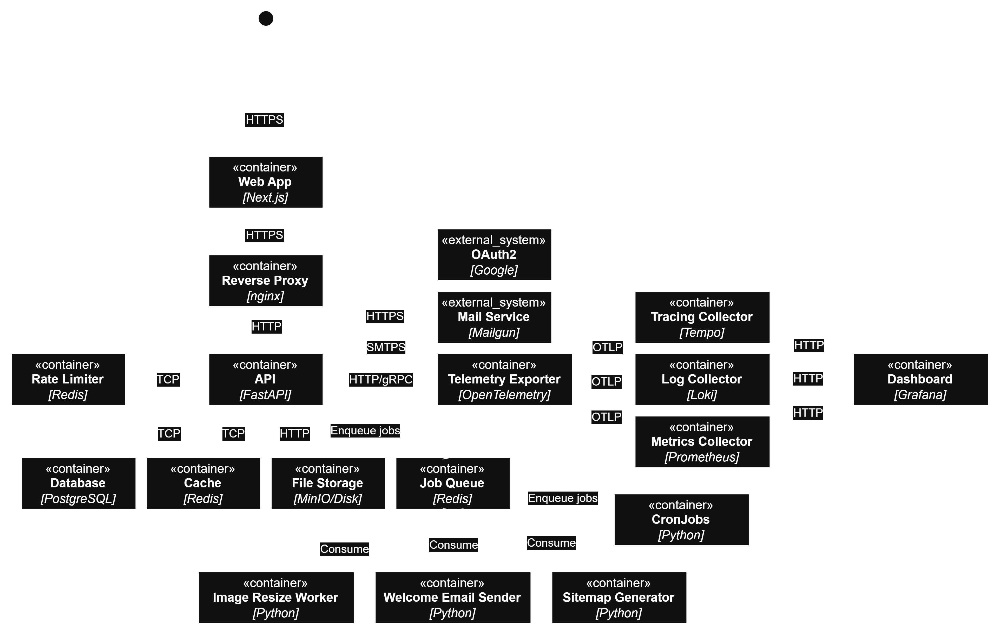

# GIÁO TRÌNH PHÁT TRIỂN ỨNG DỤNG WEB NÂNG CAO

Phiên bản V5 · FastAPI (Python) + Next.js App Router

## TÀI LIỆU ĐẶC TẢ YÊU CẦU PHẦN MỀM

### Software Requirements Specification (SRS)

Tiêu chuẩn IEEE 830 / ISO/IEC/IEEE 29148:2018

#### Dự án: Blog Ẩm thực và Nấu ăn _Culinary Blog_

|                    |                                                 |
| ------------------ | ----------------------------------------------- |
| Phiên bản tài liệu | 2.1.0                                           |
| Ngày phát hành     | 17/09/2026                                      |
| Trạng thái         | Đã duyệt (Approved)                             |
| Công nghệ Backend  | Python 3.12, FastAPI                            |
| ORM / Migration    | SQLModel + Alembic                              |
| Công nghệ Frontend | Next.js App Router, TypeScript                  |
| Cơ sở dữ liệu      | PostgreSQL 16                                   |
| Object Storage     | MinIO (S3-Compatible)                           |
| Cache              | Redis 7 (instance riêng biệt cho cache)         |
| Job Queue          | Redis 7 (instance riêng biệt cho job queue)     |
| Rate Limit         | Redis 7 (instance riêng biệt cho rate limiting) |

Tài liệu này được biên soạn theo tiêu chuẩn IEEE 830 / ISO/IEC/IEEE 29148:2018.

# LỊCH SỬ THAY ĐỔI TÀI LIỆU

| Phiên bản | Ngày       | Tác giả / Vai trò     | Nội dung thay đổi                                                                                                                                                                                              | Trạng thái   |
| --------- | ---------- | --------------------- | -------------------------------------------------------------------------------------------------------------------------------------------------------------------------------------------------------------- | ------------ |
| 2.1.0     | 17/09/2026 | Senior BA / Architect | Bổ sung instance Redis thứ ba (Rate Limit Redis), tách biệt hoàn toàn với Cache Redis và Job Queue Redis, cho bộ đếm rate limiting (`allkeys-lru`, `maxmemory` 4GB, RDB `save 60 1` — xem ADR-0006, ADR-0007). | Approved     |
| 2.0.0     | 16/09/2026 | Senior BA / Architect | Chuyển backend sang Python/FastAPI với hai instance Redis riêng biệt (cache và job queue); đồng bộ toàn bộ số liệu, tên trường (snake_case) và HTTP status code; chuyển sang cookie-based authentication.      | Approved     |
| 1.0.0     | 04/06/2026 | Senior BA / Architect | Phát hành lần đầu – Bản hoàn chỉnh theo IEEE 830 / ISO 29148.                                                                                                                                                  | Approved     |
| 0.9.0     | 20/05/2026 | Senior BA             | Bổ sung Chương 7 (Data Model), Chương 8 (API Spec) và Phụ lục.                                                                                                                                                 | Under Review |
| 0.8.0     | 05/05/2026 | Senior BA             | Hoàn thiện Chương 3 (FR), bổ sung FR-FILE, FR-JOB, FR-OBS.                                                                                                                                                     | Draft        |
| 0.5.0     | 15/04/2026 | Senior BA             | Phác thảo ban đầu: Chương 1–4 (skeleton).                                                                                                                                                                      | Draft        |

**Phê duyệt tài liệu:** Tài liệu phiên bản 2.0.0 đã được xem xét và phê duyệt bởi Trưởng nhóm Kiến trúc Hệ thống (Lead Systems Architect). Mọi thay đổi từ phiên bản 2.0.0 trở đi đều phải thông qua quy trình Change Request (CR) và được cập nhật vào bảng này.

# MỤC LỤC

| Mục                                                  | Trang |
| ---------------------------------------------------- | ----- |
| CHƯƠNG 1. GIỚI THIỆU                                 | 6     |
| CHƯƠNG 2. MÔ TẢ TỔNG QUAN HỆ THỐNG                   | 11    |
| CHƯƠNG 3. YÊU CẦU CHỨC NĂNG CHI TIẾT                 | 17    |
| 3.1. Module Xác thực và Quản lý Người dùng (FR-AUTH) | 17    |
| 3.2. Module Quản lý Danh mục (FR-CAT)                | 23    |
| 3.3. Module Quản lý Công thức Nấu ăn (FR-RCP)        | 27    |
| 3.4. Module Tìm kiếm và Phân trang (FR-SRCH)         | 36    |
| 3.5. Module Quản lý Tệp tin (FR-FILE)                | 37    |
| 3.6. Module Background Jobs (FR-JOB)                 | 38    |
| 3.7. Module Quan sát Hệ thống (FR-OBS)               | 39    |
| 4. Yêu cầu Phi Chức năng (NFR)                       | 40    |
| 5. Yêu cầu Giao diện Ngoài                           | 46    |
| 6. Kiến trúc Hệ thống                                | 50    |
| 7. Mô hình Dữ liệu                                   | 54    |
| 8. Đặc tả REST API                                   | 61    |
| Phụ lục A – HTTP Status Codes                        | 67    |
| Phụ lục B – Application Error Codes                  | 67    |
| Phụ lục C – Từ điển Thuật ngữ                        | 69    |

# CHƯƠNG 1. GIỚI THIỆU

## 1.1. Mục đích Tài liệu

Tài liệu Đặc tả Yêu cầu Phần mềm (Software Requirements Specification – SRS) này được biên soạn theo tiêu chuẩn IEEE 830-1998 và ISO/IEC/IEEE 29148:2018 nhằm mô tả đầy đủ, chính xác và nhất quán toàn bộ yêu cầu chức năng (Functional Requirements) và yêu cầu phi chức năng (Non-Functional Requirements) của dự án ứng dụng web Blog Ẩm thực và Nấu ăn (Culinary Blog).

Tài liệu này phục vụ các đối tượng sau:

- **Nhóm phát triển Backend (Python/FastAPI):** Căn cứ thiết kế API, domain model, và business rules.
- **Nhóm phát triển Frontend (Next.js/TypeScript):** Căn cứ thiết kế giao diện, luồng người dùng và tích hợp API.
- **Kỹ sư Kiểm thử (QA/QC):** Cơ sở xây dựng test cases, kiểm thử chấp nhận (acceptance testing).
- **Kiến trúc sư Hệ thống:** Tham chiếu khi đưa ra quyết định kiến trúc (architecture decisions) — xem thêm docs/adr/.
- **Giảng viên và Sinh viên:** Tài liệu học thuật mẫu cho dự án thực hành xuyên suốt giáo trình.
- **Stakeholder / Product Owner:** Phê duyệt phạm vi và ưu tiên tính năng.

**Phạm vi hiệu lực:** Tài liệu này có hiệu lực từ phiên bản 2.0.0 và là tài liệu nền tảng (baseline) cho toàn bộ vòng đời phát triển dự án. Mọi thay đổi yêu cầu sau khi tài liệu được phê duyệt phải tuân theo quy trình quản lý thay đổi (Change Management Process).

## 1.2. Phạm vi Sản phẩm

### 1.2.1. Tên và Định danh

| Thuộc tính         | Giá trị                                           |
| ------------------ | ------------------------------------------------- |
| Tên sản phẩm       | Culinary Blog – Blog Ẩm thực và Nấu ăn            |
| Định danh dự án    | CULINARY-BLOG-V1                                  |
| Loại hệ thống      | Ứng dụng Web Full-Stack (API-Driven Architecture) |
| Phiên bản sản phẩm | 1.0.0                                             |
| Môi trường đích    | Cloud/On-premise (Docker Compose + Nginx)         |

### 1.2.2. Mô tả Sản phẩm

Culinary Blog là một nền tảng web cho phép người dùng chia sẻ, khám phá và lưu trữ các công thức nấu ăn từ nhiều nền ẩm thực khác nhau. Ứng dụng cung cấp hệ sinh thái hoàn chỉnh bao gồm:

- **Nền tảng chia sẻ công thức:** Tác giả (Author) đăng tải công thức với hình ảnh, danh sách nguyên liệu chi tiết, hướng dẫn từng bước thực hiện và thông tin dinh dưỡng.
- **Tổ chức nội dung:** Phân loại công thức theo danh mục (Category), độ khó (Difficulty Level), thời gian chuẩn bị và nấu.
- **Tìm kiếm thông minh:** Full-Text Search tiếng Việt sử dụng PostgreSQL tsvector/tsquery với unaccent extension.
- **Bảo mật đa lớp:** Xác thực JWT stateless lưu trong HttpOnly cookie, phân quyền theo vai trò (RBAC) và theo tài nguyên (Resource-Based Authorization), đăng nhập Google (ID token).
- **Tối ưu hiệu năng và SEO:** Redis distributed cache, Next.js ISR, Open Graph Protocol, JSON-LD Schema.org Recipe markup.
- **Quan sát hệ thống:** Structured logging, distributed tracing (OpenTelemetry → Grafana stack), health check endpoints.

### 1.2.3. Những gì KHÔNG thuộc phạm vi

Các tính năng sau đây nằm ngoài phạm vi phiên bản 1.0.0:

- Hệ thống bình luận (Comment System) và đánh giá sao (Rating System).
- Tính năng lưu/đánh dấu công thức yêu thích (Bookmark/Favorite).
- Thông báo real-time (WebSocket).
- Ứng dụng di động native (iOS/Android).
- Thanh toán / Tính năng thương mại điện tử.
- Hệ thống nhắn tin trực tiếp giữa người dùng.
- GraphQL API (định hướng sau khóa học).

## 1.3. Định nghĩa, Từ viết tắt và Ký hiệu

| Thuật ngữ / Viết tắt | Định nghĩa đầy đủ                                                                   |
| -------------------- | ----------------------------------------------------------------------------------- |
| SRS                  | Software Requirements Specification – Đặc tả Yêu cầu Phần mềm.                      |
| FR                   | Functional Requirement – Yêu cầu chức năng.                                         |
| NFR                  | Non-Functional Requirement – Yêu cầu phi chức năng.                                 |
| ADR                  | Architecture Decision Record – Tài liệu ghi nhận quyết định kiến trúc.              |
| API                  | Application Programming Interface – Giao diện lập trình ứng dụng.                   |
| REST                 | Representational State Transfer – Kiểu kiến trúc API phổ biến nhất.                 |
| JWT                  | JSON Web Token – Chuẩn token xác thực stateless (RFC 7519).                         |
| RBAC                 | Role-Based Access Control – Kiểm soát truy cập dựa trên vai trò.                    |
| DTO                  | Data Transfer Object – Đối tượng dùng để trao đổi dữ liệu giữa các tầng/API.        |
| ORM                  | Object-Relational Mapper – Công cụ ánh xạ object-database (SQLModel/SQLAlchemy).    |
| FTS                  | Full-Text Search – Tìm kiếm toàn văn bản.                                           |
| ISR                  | Incremental Static Regeneration – Kỹ thuật tái tạo trang tĩnh của Next.js.          |
| LCP                  | Largest Contentful Paint – Core Web Vital đo tốc độ tải nội dung lớn nhất.          |
| CLS                  | Cumulative Layout Shift – Core Web Vital đo độ ổn định bố cục trang.                |
| INP                  | Interaction to Next Paint – Core Web Vital đo thời gian phản hồi tương tác.         |
| CI/CD                | Continuous Integration / Continuous Delivery – Tích hợp và triển khai liên tục.     |
| TTL                  | Time-To-Live – Thời gian sống của dữ liệu trong cache.                              |
| SSR                  | Server-Side Rendering – Render HTML trên server.                                    |
| SSG                  | Static Site Generation – Tạo trang tĩnh lúc build time.                             |
| MoSCoW               | Must Have / Should Have / Could Have / Won't Have – Mô hình phân loại ưu tiên.      |
| RFC                  | Request For Comments – Tài liệu tiêu chuẩn kỹ thuật (e.g., RFC 7807).               |
| ERD                  | Entity Relationship Diagram – Sơ đồ quan hệ thực thể.                               |
| DLQ                  | Dead-Letter Queue – Hàng đợi chứa job thất bại vĩnh viễn sau khi hết lượt retry.    |
| CDN                  | Content Delivery Network – Mạng phân phối nội dung.                                 |
| MIME                 | Multipurpose Internet Mail Extensions – Chuẩn định dạng tệp trên Internet.          |
| JSON-LD              | JavaScript Object Notation for Linked Data – Định dạng dữ liệu có cấu trúc cho SEO. |

## 1.4. Tài liệu Tham chiếu

| STT | Tài liệu / Tiêu chuẩn                                                             | Nguồn / URL                            |
| --- | --------------------------------------------------------------------------------- | -------------------------------------- |
| 1   | IEEE Std 830-1998 – Recommended Practice for Software Requirements Specifications | ieeexplore.ieee.org/document/720574    |
| 2   | ISO/IEC/IEEE 29148:2018 – Requirements Engineering                                | iso.org/standard/72089.html            |
| 3   | OWASP Top 10:2021                                                                 | owasp.org/www-project-top-ten          |
| 4   | RFC 7807 – Problem Details for HTTP APIs                                          | datatracker.ietf.org/doc/html/rfc7807  |
| 5   | RFC 7519 – JSON Web Token (JWT)                                                   | datatracker.ietf.org/doc/html/rfc7519  |
| 6   | RFC 6749 – The OAuth 2.0 Authorization Framework                                  | datatracker.ietf.org/doc/html/rfc6749  |
| 7   | FastAPI Documentation                                                             | fastapi.tiangolo.com                   |
| 8   | SQLModel Documentation                                                            | sqlmodel.tiangolo.com                  |
| 9   | Alembic Documentation                                                             | alembic.sqlalchemy.org                 |
| 10  | Next.js 15 App Router Documentation                                               | nextjs.org/docs                        |
| 11  | PostgreSQL 16 Documentation – Full-Text Search                                    | postgresql.org/docs/16/textsearch.html |
| 12  | Redis 7 Documentation                                                             | redis.io/docs                          |
| 13  | MinIO S3-Compatible Object Storage                                                | min.io/docs                            |
| 14  | Google Web Vitals – Core Web Vitals                                               | web.dev/explore/learn-core-web-vitals  |
| 15  | Schema.org Recipe – Structured Data                                               | schema.org/Recipe                      |
| 16  | OpenTelemetry Python Documentation                                                | opentelemetry.io/docs/languages/python |
| 17  | Google Identity Services (Sign In With Google) Documentation                      | developers.google.com/identity/gsi/web |
| 18  | Grafana / Loki / Tempo / Prometheus Documentation                                 | grafana.com/docs                       |
| 19  | Pydantic Documentation                                                            | docs.pydantic.dev                      |
| 20  | Giáo trình Phát triển Ứng dụng Web Nâng cao V5 – Nội bộ                           | N/A (tài liệu nội bộ)                  |

## 1.5. Tổng quan Tài liệu

Tài liệu SRS này được tổ chức thành 8 chương chính và 3 phụ lục, theo cấu trúc từ tổng quan đến chi tiết:

- **Chương 2 – Mô tả Tổng quan:** Bối cảnh sản phẩm, chức năng tóm tắt, các lớp người dùng, môi trường vận hành và ràng buộc thiết kế.
- **Chương 3 – Yêu cầu Chức năng:** 29 FR được đặc tả chi tiết theo format chuẩn, nhóm thành 7 module chức năng.
- **Chương 4 – Yêu cầu Phi chức năng:** Hiệu năng, bảo mật, khả năng sử dụng, độ tin cậy, khả năng bảo trì/mở rộng và SEO.
- **Chương 5 – Giao diện Ngoài:** Tích hợp với các hệ thống và dịch vụ ngoài (Google Identity Services, MinIO, Redis, SMTP).
- **Chương 6 – Kiến trúc Hệ thống:** Kiến trúc FastAPI backend, Next.js App Router frontend, hai instance Redis (cache + job queue), observability stack và deployment.
- **Chương 7 – Mô hình Dữ liệu:** ERD mô tả văn bản và bảng định nghĩa chi tiết từng entity/table (snake_case).
- **Chương 8 – Đặc tả API REST:** Quy ước, chuẩn lỗi RFC 7807, và bảng tổng hợp tất cả endpoint.
- **Phụ lục A-C:** HTTP Status Codes, Application Error Codes, và Từ điển thuật ngữ.

# CHƯƠNG 2. MÔ TẢ TỔNG QUAN HỆ THỐNG

## 2.1. Bối cảnh Sản phẩm

### 2.1.1. Vị trí trong Hệ sinh thái

Culinary Blog vận hành theo mô hình API-Driven Architecture, trong đó Backend (FastAPI) và Frontend (Next.js) là hai hệ thống độc lập giao tiếp hoàn toàn qua HTTP/JSON RESTful API, đặt sau một Reverse Proxy (nginx). Không có server-side rendering truyền thống hay shared view engine giữa hai tầng.

Sơ đồ bối cảnh hệ thống (Container Diagram)

### 2.1.2. Quan hệ với Hệ thống Ngoài

| Hệ thống Ngoài            | Vai trò                                                                                              | Giao thức / Chuẩn                | Hướng tích hợp                                            |
| ------------------------- | ---------------------------------------------------------------------------------------------------- | -------------------------------- | --------------------------------------------------------- |
| PostgreSQL 16             | Hệ quản trị CSDL quan hệ chính (RDBMS)                                                               | TCP + asyncpg (SQLModel)         | API → PostgreSQL                                          |
| Cache Redis 7             | Distributed Cache (category/recipe/search)                                                           | TCP (redis-py, async)            | API → Cache Redis                                         |
| Job Queue Redis 7         | Hàng đợi job nền, tách biệt hoàn toàn với Cache Redis                                                | TCP (redis-py, async)            | API → Job Queue Redis; Workers/CronJobs ↔ Job Queue Redis |
| Rate Limit Redis 7        | Bộ đếm rate limiting (auth/API chung/upload), tách biệt hoàn toàn với Cache Redis và Job Queue Redis | TCP (redis-py, async)            | API → Rate Limit Redis                                    |
| MinIO (S3)                | Object Storage cho ảnh công thức                                                                     | HTTP/S3 API                      | API → MinIO                                               |
| Google (ID Token)         | Đăng nhập bên thứ ba (Identity Provider)                                                             | HTTPS (Google Identity Services) | Client → Google; API xác thực ID token                    |
| Mail Service (SMTP)       | Gửi welcome email                                                                                    | SMTPS                            | Welcome Email Worker → Mail Service                       |
| OpenTelemetry Collector   | Thu thập trace/log/metric                                                                            | OTLP / gRPC, HTTP                | API/Workers → Collector                                   |
| Tempo / Loki / Prometheus | Lưu trữ trace / log / metric                                                                         | OTLP                             | Collector → Tempo/Loki/Prometheus                         |
| Grafana                   | Dashboard quan sát hệ thống                                                                          | HTTP                             | Grafana → Tempo/Loki/Prometheus                           |
| Nginx (Reverse Proxy)     | SSL termination, load balancing, static serving                                                      | HTTP/HTTPS                       | Client → Nginx → Services                                 |

## 2.2. Chức năng Sản phẩm Tổng quát

Culinary Blog cung cấp 7 nhóm chức năng chính, được hiện thực hóa qua 29 Functional Requirements chi tiết tại Chương 3:

| Nhóm chức năng                | Mã nhóm  | Số FR  | Mô tả tóm tắt                                                                         |
| ----------------------------- | -------- | ------ | ------------------------------------------------------------------------------------- |
| Xác thực & Quản lý Người dùng | FR-AUTH  | 7      | Đăng ký, đăng nhập (email + Google), JWT refresh (cookie), logout, quản lý profile.   |
| Quản lý Danh mục              | FR-CAT   | 5      | CRUD danh mục công thức (Category) – phân quyền Admin.                                |
| Quản lý Công thức nấu ăn      | FR-RCP   | 10     | CRUD recipe, publish/archive, quản lý ảnh/bước/nguyên liệu.                           |
| Tìm kiếm & Phân trang         | FR-SRCH  | 1      | Full-Text Search (PostgreSQL); filter/sort/pagination gộp vào FR-RCP-001/FR-SRCH-001. |
| Quản lý Tệp tin               | FR-FILE  | 2      | Upload/Delete ảnh trên MinIO S3-compatible.                                           |
| Background Jobs               | FR-JOB   | 3      | Welcome email, thumbnail generation, sitemap XML (Redis Job Queue + worker riêng).    |
| Quan sát Hệ thống             | FR-OBS   | 1      | Health checks (logging/tracing là ghi chú triển khai, không tính FR riêng).           |
|                               | **Tổng** | **29** |                                                                                       |

## 2.3. Các Lớp Người dùng và Đặc điểm

Hệ thống định nghĩa 3 loại tác nhân (Actor) với quyền hạn khác nhau:

| Vai trò                                                                                                              | Mô tả                                                                         | Điều kiện                        | Quyền hạn chính                                                                              | Ưu tiên phục vụ            |
| -------------------------------------------------------------------------------------------------------------------- | ----------------------------------------------------------------------------- | -------------------------------- | -------------------------------------------------------------------------------------------- | -------------------------- |
| Khách (Guest / Anonymous)                                                                                            | Người dùng chưa xác thực.                                                     | Không cần tài khoản              | Xem danh sách & chi tiết recipe (Published), xem danh mục, tìm kiếm. KHÔNG được tạo/sửa/xóa. | Cao (đại đa số người dùng) |
| Tác giả (Author)                                                                                                     | Người dùng đã đăng ký và xác thực thành công. Được tự động gán khi đăng ký.   | Có tài khoản & cookie JWT hợp lệ | + Tất cả quyền của Guest.                                                                    |
| + Tạo/sửa/xóa recipe CỦA MÌNH (soft delete). Upload ảnh, quản lý steps/ingredients. Publish/Archive recipe của mình. | Cao (nhà sản xuất nội dung)                                                   |
| Quản trị viên (Admin)                                                                                                | Người quản lý hệ thống với quyền cao nhất. Gán thủ công qua database seeding. | Có tài khoản & role Admin        | + Tất cả quyền của Author trên MỌI recipe (Admin luôn được xem là chủ sở hữu hợp lệ).        |
| + Quản lý (CRUD) danh mục.                                                                                           | Trung bình (số lượng ít)                                                      |

**Ghi chú về phân quyền:** Hệ thống triển khai 3 tầng phân quyền. (1) Role-Based Authorization: phân biệt quyền dựa trên role (Guest/Author/Admin). (2) Resource-Based Authorization: Author chỉ sửa/xóa/xem được recipe của chính mình (`author_id == current_user_id`); Admin không bao giờ bị xem là "không phải chủ sở hữu" trên bất kỳ resource nào — với mục đích authorization, Admin luôn được coi là đồng sở hữu. (3) Policy-Based Authorization: policy "VerifiedAuthor" yêu cầu email đã xác nhận.

## 2.4. Môi trường Vận hành

### 2.4.1. Môi trường Server (Production)

| Thành phần       | Yêu cầu tối thiểu           | Khuyến nghị                     | Ghi chú                                                          |
| ---------------- | --------------------------- | ------------------------------- | ---------------------------------------------------------------- |
| Hệ điều hành     | Linux Ubuntu 22.04 LTS      | Ubuntu 22.04 LTS / Debian 12    | Docker phải được cài đặt                                         |
| Python           | Python 3.12                 | Python 3.12.x latest patch      | Cung cấp qua Docker image python:3.12-slim                       |
| Node.js          | Node.js 20 LTS (build only) | Node.js 22 LTS                  | Chỉ cần lúc build Next.js; production dùng standalone output     |
| PostgreSQL       | PostgreSQL 16.x             | PostgreSQL 16.x                 | Extensions: unaccent, pg_trgm bắt buộc                           |
| Cache Redis      | Redis 7.x                   | Redis 7.2.x                     | maxmemory 2GB, eviction LFU (xem ADR-0003)                       |
| Job Queue Redis  | Redis 7.x                   | Redis 7.2.x                     | AOF (fsync everysec), noeviction, 3 queue + 3 DLQ (xem ADR-0004) |
| Rate Limit Redis | Redis 7.x                   | Redis 7.2.x                     | maxmemory 4GB, eviction LRU, RDB `save 60 1` (xem ADR-0007)      |
| MinIO            | MinIO RELEASE.2024+         | MinIO latest stable             | Bucket policy: public-read cho recipe images                     |
| Docker           | Docker Engine 24.x          | Docker Engine 27.x + Compose v2 | Docker Compose cho local dev và staging                          |
| Nginx            | Nginx 1.24+                 | Nginx 1.26+ (stable)            | Reverse proxy, SSL termination                                   |
| RAM              | 4 GB minimum                | 8 GB+                           | RAM cần tăng nếu Redis cache lớn                                 |
| CPU              | 2 vCPU minimum              | 4 vCPU+                         | CPU-intensive: FTS indexing, image processing (worker riêng)     |
| Disk             | 20 GB SSD minimum           | 50 GB+ SSD                      | MinIO object storage tốn nhiều disk                              |

### 2.4.2. Môi trường Phát triển (Development)

| Thành phần     | Yêu cầu                                                                                                               |
| -------------- | --------------------------------------------------------------------------------------------------------------------- |
| Python + uv    | Python 3.12+, `uv` làm package/dependency manager (pyproject.toml + uv.lock)                                          |
| Node.js        | Node.js 20+ LTS với npm 10+                                                                                           |
| Docker Desktop | Docker Desktop 4.x+ (Windows/macOS) hoặc Docker Engine (Linux) – chạy PostgreSQL, 2×Redis, MinIO, Grafana stack local |
| IDE / Editor   | VS Code / PyCharm / Rider với Python + Ruff/Pyright extension                                                         |
| Git            | Git 2.40+ với Git LFS (nếu lưu asset lớn)                                                                             |
| API Docs       | FastAPI tự sinh OpenAPI UI tại `/docs` (Swagger) và `/redoc`                                                          |

### 2.4.3. Yêu cầu Trình duyệt Client

| Trình duyệt             | Phiên bản tối thiểu | Ghi chú                                          |
| ----------------------- | ------------------- | ------------------------------------------------ |
| Google Chrome           | 90+                 | Khuyến nghị chính – tốt nhất cho Developer Tools |
| Mozilla Firefox         | 88+                 | Hỗ trợ đầy đủ                                    |
| Microsoft Edge          | 90+ (Chromium)      | Hỗ trợ đầy đủ (Chromium-based)                   |
| Safari                  | 14+ (macOS 11+)     | Hỗ trợ đầy đủ; Safari 13 trở xuống KHÔNG đảm bảo |
| Mobile Chrome (Android) | 90+                 | Responsive design, touch-friendly                |
| Mobile Safari (iOS)     | iOS 14+             | Hỗ trợ đầy đủ                                    |
| Internet Explorer       | Mọi phiên bản       | KHÔNG hỗ trợ (EOL)                               |

## 2.5. Ràng buộc Thiết kế và Hiện thực

Các ràng buộc sau đây là bắt buộc và không thể thương lượng trong suốt quá trình phát triển:

| Mã ràng buộc | Loại                 | Mô tả ràng buộc                                                                                                                                                                                                                             |
| ------------ | -------------------- | ------------------------------------------------------------------------------------------------------------------------------------------------------------------------------------------------------------------------------------------- |
| CONS-001     | Kiến trúc            | Backend PHẢI phân lớp theo mô hình routers → services → repositories: routers (FastAPI `APIRouter`, chỉ HTTP concerns), services (business logic), repositories (truy cập dữ liệu qua SQLModel). Domain models không phụ thuộc router/HTTP. |
| CONS-002     | Validation           | Toàn bộ request/response schema PHẢI khai báo qua Pydantic models. Validation chạy tại tầng router/schema, không viết validation thủ công trong service.                                                                                    |
| CONS-003     | Ngôn ngữ / Framework | Backend: Python 3.12, FastAPI (async). Frontend: Next.js App Router (không dùng Pages Router).                                                                                                                                              |
| CONS-004     | Bảo mật              | Xác thực PHẢI dùng JWT stateless (access token 15 phút, refresh token 7 ngày, 512-bit random), truyền qua HttpOnly cookie (`SameSite=Lax`, `Secure`). Mật khẩu PHẢI hash bằng thuật toán an toàn (Argon2id hoặc bcrypt) qua `passlib`.      |
| CONS-005     | API Design           | API PHẢI tuân thủ RESTful design. Phản hồi lỗi PHẢI theo RFC 7807 (`application/problem+json`). API versioning qua URL path (`/api/v1/`). Toàn bộ field JSON dùng `snake_case`.                                                             |
| CONS-006     | Database             | PostgreSQL là DBMS duy nhất. Migrations qua Alembic (autogenerate từ SQLModel). Không viết raw SQL với user input chưa parameterize.                                                                                                        |
| CONS-007     | File Upload          | Kích thước tệp tải lên tối đa 5 MB. Định dạng chỉ chấp nhận: image/jpeg, image/png, image/webp, image/avif. Kiểm tra magic bytes (không chỉ MIME/Content-Type header).                                                                      |
| CONS-008     | Job Queue            | Job nền PHẢI đi qua Job Queue Redis (instance riêng biệt với Cache Redis) và được xử lý bởi worker container độc lập. Không dùng in-process background task cho job có thể mất khi restart.                                                 |
| CONS-009     | Container            | Ứng dụng PHẢI được đóng gói Docker. Dockerfile multi-stage build. Docker Compose cho local development, khớp với `container-diagram.png`.                                                                                                   |
| CONS-010     | Logging              | Structured logging (JSON) là bắt buộc. Mọi log entry PHẢI có `correlation_id`, `request_path`, `user_id` (khi đã xác thực), xuất ra Loki.                                                                                                   |

## 2.6. Giả định và Phụ thuộc

### 2.6.1. Giả định

- Môi trường development có kết nối Internet để pull Docker images và package PyPI/npm.
- PostgreSQL, 2×Redis và MinIO được cung cấp qua Docker Compose trong development và dưới dạng managed service (hoặc VPS) trong production.
- Người dùng cuối có trình duyệt hiện đại và kết nối Internet đủ ổn định để load ảnh từ MinIO.
- Dữ liệu test (seed) được tạo bằng thư viện `Faker` với 50 recipe mẫu và 5 tác giả mẫu.
- Mail Service (SMTP, Mailhog trong dev) được cấu hình sẵn khi triển khai production để gửi welcome email.
- Giới hạn dữ liệu kỳ vọng (initial scale): ≤ 10.000 công thức, ≤ 5.000 người dùng, ≤ 50 danh mục – phù hợp với single-server deployment.

### 2.6.2. Phụ thuộc Bên ngoài

| Phụ thuộc                | Phiên bản           | Mức độ ảnh hưởng nếu không khả dụng           | Kế hoạch dự phòng                                                                                                                                                                |
| ------------------------ | ------------------- | --------------------------------------------- | -------------------------------------------------------------------------------------------------------------------------------------------------------------------------------- |
| Google Identity Services | v2 (ID Token)       | Cao – Mất chức năng đăng nhập Google          | Vẫn có đăng nhập email/password. Hiển thị thông báo "Google login tạm thời không khả dụng".                                                                                      |
| MinIO / S3               | MinIO RELEASE.2024+ | Cao – Không upload/xem được ảnh mới           | Fallback về local FileSystem storage (development only). Production cần MinIO.                                                                                                   |
| Cache Redis              | 7.x                 | Trung bình – Mất cache, hiệu năng giảm        | Hệ thống tiếp tục hoạt động nhưng mọi request đều query database (cache-aside miss, graceful).                                                                                   |
| Job Queue Redis          | 7.x                 | Thấp/Trung bình – Job nền không chạy          | `noeviction` bảo vệ job đã enqueue; nếu instance down, job mới không được enqueue được, API vẫn phục vụ request chính.                                                           |
| Rate Limit Redis         | 7.x                 | Thấp – Rate limiting tạm thời không hoạt động | Fail-open: nếu instance down, request được cho qua không giới hạn (graceful) thay vì chặn toàn bộ API; chấp nhận tạm mất bảo vệ brute-force/abuse cho đến khi instance phục hồi. |
| PostgreSQL               | 16.x                | Rất cao – Toàn bộ hệ thống ngừng              | Backup định kỳ (`pg_dump`). Readiness probe sẽ fail, Nginx trả 503.                                                                                                              |

# CHƯƠNG 3. YÊU CẦU CHỨC NĂNG CHI TIẾT

Chương này đặc tả chi tiết 29 Functional Requirements (FR) được nhóm thành 7 module chức năng. Mỗi FR được mô tả theo template chuẩn: Mã yêu cầu, Tên, Nhóm chức năng, Tác nhân, Mức ưu tiên (MoSCoW), Mô tả, Điều kiện tiên quyết, Luồng chính, Luồng thay thế/Ngoại lệ, HTTP Endpoint, Kết quả mong đợi và HTTP Status Code. Toàn bộ field trong request/response JSON dùng `snake_case` (CONS-005).

**Quy ước mức ưu tiên MoSCoW:** M (Must Have – Bắt buộc), S (Should Have – Nên có), C (Could Have – Có thể có), W (Won't Have – Không trong scope hiện tại).

## 3.1. Module Xác thực và Quản lý Người dùng (FR-AUTH)

Module này quản lý toàn bộ vòng đời xác thực người dùng: đăng ký, đăng nhập đa phương thức, duy trì phiên làm việc với cơ chế token rotation, đến quản lý hồ sơ cá nhân. Access token và refresh token đều được server set vào **HttpOnly cookie** (`access_token`, `refresh_token`) — không bao giờ trả về trong JSON body, và client không tự tay đính kèm `Authorization: Bearer`. Cookie flags: `HttpOnly`, `Secure`, `SameSite=Lax`, `Path` giới hạn phù hợp (`/api/v1/auth/refresh` cho refresh_token). CSRF được giảm thiểu nhờ `SameSite=Lax` kết hợp CORS whitelist nghiêm ngặt (không wildcard).

### FR-AUTH-001: Đăng ký Tài khoản (User Registration)

|                          |                                                                                                                                                                                                                                                                                                                                                                         |
| ------------------------ | ----------------------------------------------------------------------------------------------------------------------------------------------------------------------------------------------------------------------------------------------------------------------------------------------------------------------------------------------------------------------- |
| Mã yêu cầu               | FR-AUTH-001                                                                                                                                                                                                                                                                                                                                                             |
| Tên yêu cầu              | Đăng ký Tài khoản Mới                                                                                                                                                                                                                                                                                                                                                   |
| Nhóm chức năng           | Module Xác thực và Quản lý Người dùng (FR-AUTH)                                                                                                                                                                                                                                                                                                                         |
| Tác nhân                 | Khách (Guest / Anonymous User)                                                                                                                                                                                                                                                                                                                                          |
| Mức ưu tiên (MoSCoW)     | M – Must Have (Bắt buộc)                                                                                                                                                                                                                                                                                                                                                |
| Mô tả                    | Hệ thống cho phép người dùng chưa có tài khoản tạo một tài khoản mới bằng `display_name`, `email`, `password`. Sau khi đăng ký thành công, người dùng tự động được gán role "author" và được auto-login: access/refresh token được set vào cookie ngay trong response. Hệ thống enqueue job gửi welcome email vào Job Queue Redis (worker riêng xử lý, xem FR-JOB-001). |
| Điều kiện tiên quyết     | 1. Người dùng chưa đăng nhập vào hệ thống. 2. Endpoint `POST /api/v1/auth/register` đang hoạt động. 3. PostgreSQL đang kết nối thành công.                                                                                                                                                                                                                              |
| Luồng chính (Happy Path) | 1. Client gửi `POST /api/v1/auth/register` với body: `{ "display_name": "...", "email": "...", "password": "..." }`.                                                                                                                                                                                                                                                    |

2. Pydantic schema validate: `display_name` 2–100 ký tự, `email` đúng format, `password` tối thiểu 8 ký tự (1 chữ hoa, 1 chữ số, 1 ký tự đặc biệt).
3. Service kiểm tra `email` chưa tồn tại.
4. Tạo `User` mới, hash `password` bằng Argon2id (`passlib`), gán role "author".
5. Tạo access token (JWT HS256, 15 phút) và refresh token (512-bit random, hash SHA-256 trước khi lưu DB, 7 ngày).
6. Lưu refresh token hash vào bảng `refresh_tokens`.
7. Enqueue job `welcome_email` lên Job Queue Redis (fire-and-forget).
8. Set-Cookie `access_token`, `refresh_token` (HttpOnly, Secure, SameSite=Lax).
9. Trả về HTTP 201 Created với body: `{ id, display_name, email, avatar_url, roles }` (không chứa token). |
   | Luồng thay thế / Ngoại lệ | A1 – Email đã tồn tại: HTTP 409 Conflict.
   A2 – Password không đủ mạnh / dữ liệu không hợp lệ: HTTP 422 Unprocessable Entity (Pydantic validation error, RFC 7807).
   A3 – Database không kết nối: HTTP 500 Internal Server Error (không lộ stack trace). |
   | HTTP Method & Endpoint | `POST /api/v1/auth/register` |
   | Kết quả mong đợi | Tài khoản mới được tạo, role "author" được gán, refresh token hash được persist, job welcome email được enqueue. Cookie chứa access/refresh token được set trên response. |
   | HTTP Status Code trả về | 201 Created – Đăng ký thành công. 409 Conflict – Email đã tồn tại. 422 Unprocessable Entity – Dữ liệu không hợp lệ. 500 Internal Server Error – Lỗi hệ thống. |

### FR-AUTH-002: Đăng nhập bằng Email/Mật khẩu (Local Login)

|                          |                                                                                                                                                                                                                                                  |
| ------------------------ | ------------------------------------------------------------------------------------------------------------------------------------------------------------------------------------------------------------------------------------------------ |
| Mã yêu cầu               | FR-AUTH-002                                                                                                                                                                                                                                      |
| Tên yêu cầu              | Đăng nhập bằng Email và Mật khẩu                                                                                                                                                                                                                 |
| Nhóm chức năng           | Module Xác thực và Quản lý Người dùng (FR-AUTH)                                                                                                                                                                                                  |
| Tác nhân                 | Tác giả đã đăng ký (Author) hoặc Quản trị viên (Admin)                                                                                                                                                                                           |
| Mức ưu tiên (MoSCoW)     | M – Must Have (Bắt buộc)                                                                                                                                                                                                                         |
| Mô tả                    | Người dùng đã có tài khoản đăng nhập bằng email và mật khẩu. Mỗi lần đăng nhập thành công tạo một cặp access/refresh token mới, set vào cookie. Token Rotation: refresh token cũ không bị xóa ngay mà đánh dấu đã dùng (phát hiện reuse attack). |
| Điều kiện tiên quyết     | 1. Người dùng đã có tài khoản hợp lệ. 2. Tài khoản chưa bị khóa (`locked_until` đã qua hoặc null).                                                                                                                                               |
| Luồng chính (Happy Path) | 1. Client gửi `POST /api/v1/auth/login` với `{ "email": "...", "password": "..." }`.                                                                                                                                                             |

2. Tìm user theo `email`.
3. Verify password qua Argon2id.
4. Kiểm tra `locked_until` chưa đến hạn.
5. Tạo access + refresh token mới (512-bit), lưu refresh token hash.
6. Reset `failed_login_count` về 0.
7. Set-Cookie access/refresh token. Trả HTTP 200 OK với thông tin user (không chứa token). |
   | Luồng thay thế / Ngoại lệ | A1 – Tài khoản không tồn tại hoặc sai mật khẩu: HTTP 401 Unauthorized, message generic "Email hoặc mật khẩu không đúng" (chống User Enumeration).
   A2 – Tài khoản bị khóa: HTTP 423 Locked.
   A3 – Vượt quá 5 lần thử sai: `failed_login_count` tăng, khóa 15 phút (`locked_until`). |
   | HTTP Method & Endpoint | `POST /api/v1/auth/login` |
   | Kết quả mong đợi | Access/refresh token mới được tạo và set vào cookie; refresh token hash lưu DB. |
   | HTTP Status Code trả về | 200 OK – Đăng nhập thành công. 401 Unauthorized – Sai email/mật khẩu. 422 Unprocessable Entity – Dữ liệu không hợp lệ. 423 Locked – Tài khoản bị khóa. |

### FR-AUTH-003: Đăng nhập bằng Google (ID Token)

|                          |                                                                                                                                                                                                                                                                                                                                                                                                                                                                                                                                         |
| ------------------------ | --------------------------------------------------------------------------------------------------------------------------------------------------------------------------------------------------------------------------------------------------------------------------------------------------------------------------------------------------------------------------------------------------------------------------------------------------------------------------------------------------------------------------------------- |
| Mã yêu cầu               | FR-AUTH-003                                                                                                                                                                                                                                                                                                                                                                                                                                                                                                                             |
| Tên yêu cầu              | Đăng nhập / Đăng ký bằng Google (Google Identity Services ID Token)                                                                                                                                                                                                                                                                                                                                                                                                                                                                     |
| Nhóm chức năng           | Module Xác thực và Quản lý Người dùng (FR-AUTH)                                                                                                                                                                                                                                                                                                                                                                                                                                                                                         |
| Tác nhân                 | Khách (Guest) – lần đầu / Người dùng đã đăng ký trước đó qua Google                                                                                                                                                                                                                                                                                                                                                                                                                                                                     |
| Mức ưu tiên (MoSCoW)     | S – Should Have                                                                                                                                                                                                                                                                                                                                                                                                                                                                                                                         |
| Mô tả                    | Frontend nhúng nút "Sign in with Google" bằng Google Identity Services JS SDK và nhận về một **ID Token** (JWT do Google ký) trực tiếp trên trình duyệt — không có bước redirect/callback phía backend. Frontend POST ID token này lên API; API xác thực chữ ký/audience của token với public key của Google rồi tạo/liên kết tài khoản. Nếu là lần đầu, hệ thống tạo tài khoản mới từ Google profile (email, tên, avatar) và gán role "author". Nếu email đã tồn tại từ đăng ký thủ công, liên kết Google login với tài khoản hiện có. |
| Điều kiện tiên quyết     | 1. `GOOGLE_CLIENT_ID` đã được cấu hình ở cả frontend và backend (để verify `aud`). 2. Người dùng có tài khoản Google hợp lệ.                                                                                                                                                                                                                                                                                                                                                                                                            |
| Luồng chính (Happy Path) | 1. Frontend hiển thị nút Google, người dùng đăng nhập trên popup của Google, nhận `id_token`.                                                                                                                                                                                                                                                                                                                                                                                                                                           |

2. Frontend gửi `POST /api/v1/auth/google` với `{ "id_token": "..." }`.
3. Backend verify chữ ký + `aud` + `exp` của `id_token` bằng public key của Google.
4. Tìm user theo `google_sub` (subject claim); nếu chưa có, kiểm tra `email` — nếu email chưa tồn tại thì tạo `User` mới từ Google profile, gán role "author"; nếu email đã tồn tại thì liên kết `google_sub` vào user hiện có.
5. Tạo access + refresh token, set cookie.
6. Trả HTTP 200 OK với thông tin user. |
   | Luồng thay thế / Ngoại lệ | A1 – `id_token` không hợp lệ, hết hạn, hoặc sai `aud`: HTTP 401 Unauthorized.
   A2 – Google trả về profile thiếu email: HTTP 400 Bad Request. |
   | HTTP Method & Endpoint | `POST /api/v1/auth/google` |
   | Kết quả mong đợi | Người dùng được đăng nhập (hoặc tự động đăng ký) với role "author"; cookie được set. |
   | HTTP Status Code trả về | 200 OK – Đăng nhập/đăng ký thành công. 401 Unauthorized – id_token không hợp lệ. 400 Bad Request – Thiếu thông tin profile. |

### FR-AUTH-004: Làm mới Access Token (Token Refresh)

|                          |                                                                                                                                                                                                                                                                                                            |
| ------------------------ | ---------------------------------------------------------------------------------------------------------------------------------------------------------------------------------------------------------------------------------------------------------------------------------------------------------- |
| Mã yêu cầu               | FR-AUTH-004                                                                                                                                                                                                                                                                                                |
| Tên yêu cầu              | Làm mới Access Token bằng Refresh Token                                                                                                                                                                                                                                                                    |
| Nhóm chức năng           | Module Xác thực và Quản lý Người dùng (FR-AUTH)                                                                                                                                                                                                                                                            |
| Tác nhân                 | Tác giả (Author) / Quản trị viên (Admin) – có refresh token cookie hợp lệ                                                                                                                                                                                                                                  |
| Mức ưu tiên (MoSCoW)     | M – Must Have (Bắt buộc)                                                                                                                                                                                                                                                                                   |
| Mô tả                    | Khi access token hết hạn (15 phút), client gọi endpoint refresh; trình duyệt tự động gửi cookie `refresh_token`. Cơ chế Token Rotation bắt buộc: refresh token cũ bị revoke (`revoked_at = now()`), refresh token mới (512-bit) được tạo và set cookie. Đây là biện pháp chống Refresh Token Reuse Attack. |
| Điều kiện tiên quyết     | 1. Cookie `refresh_token` hợp lệ (chưa hết hạn, chưa bị revoke). 2. User tương ứng còn tồn tại và chưa bị khóa.                                                                                                                                                                                            |
| Luồng chính (Happy Path) | 1. Client gửi `POST /api/v1/auth/refresh` (không cần body — token đọc từ cookie).                                                                                                                                                                                                                          |

2. Backend hash refresh token nhận được, tìm bản ghi khớp `token_hash` trong `refresh_tokens`.
3. Kiểm tra: tồn tại, `revoked_at IS NULL`, `expires_at > now()`, user vẫn active.
4. Đánh dấu token cũ: `revoked_at = now()`, `replaced_by_token_hash = <hash mới>`.
5. Tạo access + refresh token mới, set cookie.
6. Trả HTTP 200 OK với thông tin user. |
   | Luồng thay thế / Ngoại lệ | A1 – Refresh token không tìm thấy: HTTP 401 Unauthorized.
   A2 – Refresh token đã hết hạn: HTTP 401, client phải đăng nhập lại.
   A3 – Refresh token đã bị revoke (Reuse Attack detected): HTTP 401. Log SECURITY ALERT (WARNING) và revoke toàn bộ refresh token còn hiệu lực của user đó.
   A4 – User bị xóa/khóa sau khi token được cấp: HTTP 401. |
   | HTTP Method & Endpoint | `POST /api/v1/auth/refresh` |
   | Kết quả mong đợi | Refresh token cũ bị revoke. Access token mới (15 phút) và refresh token mới (512-bit, 7 ngày) được set vào cookie. |
   | HTTP Status Code trả về | 200 OK – Refresh thành công. 401 Unauthorized – Token không hợp lệ, hết hạn hoặc đã bị revoke. |

### FR-AUTH-005: Đăng xuất (Logout / Token Revocation)

|                          |                                                                                                                                                                                                          |
| ------------------------ | -------------------------------------------------------------------------------------------------------------------------------------------------------------------------------------------------------- |
| Mã yêu cầu               | FR-AUTH-005                                                                                                                                                                                              |
| Tên yêu cầu              | Đăng xuất và Thu hồi Refresh Token                                                                                                                                                                       |
| Nhóm chức năng           | Module Xác thực và Quản lý Người dùng (FR-AUTH)                                                                                                                                                          |
| Tác nhân                 | Tác giả (Author) / Quản trị viên (Admin) đang đăng nhập                                                                                                                                                  |
| Mức ưu tiên (MoSCoW)     | M – Must Have                                                                                                                                                                                            |
| Mô tả                    | Người dùng đăng xuất khỏi hệ thống. Vì JWT access token là stateless, logout chủ yếu revoke refresh token tương ứng trong database và xóa cả hai cookie (`access_token`, `refresh_token`) trên response. |
| Điều kiện tiên quyết     | 1. Request có cookie `access_token` hợp lệ.                                                                                                                                                              |
| Luồng chính (Happy Path) | 1. Client gửi `POST /api/v1/auth/logout` (cookie tự động gửi kèm).                                                                                                                                       |

2. Middleware xác thực `access_token` cookie.
3. Tìm refresh token hiện tại (từ cookie `refresh_token`) và đánh dấu `revoked_at = now()`.
4. Xóa cookie `access_token` và `refresh_token` (Set-Cookie với `Max-Age=0`).
5. Trả HTTP 204 No Content. |
   | Luồng thay thế / Ngoại lệ | A1 – Refresh token không tìm thấy: vẫn trả HTTP 204 (idempotent).
   A2 – Access token cookie thiếu/hết hạn: HTTP 401 Unauthorized. |
   | HTTP Method & Endpoint | `POST /api/v1/auth/logout` |
   | Kết quả mong đợi | Refresh token bị đánh dấu `revoked_at`. Cả hai cookie bị xóa khỏi trình duyệt. |
   | HTTP Status Code trả về | 204 No Content – Đăng xuất thành công (idempotent). 401 Unauthorized – Chưa đăng nhập. |

### FR-AUTH-006: Xem Hồ sơ Cá nhân (View Profile)

|                          |                                                                                                                                          |
| ------------------------ | ---------------------------------------------------------------------------------------------------------------------------------------- |
| Mã yêu cầu               | FR-AUTH-006                                                                                                                              |
| Tên yêu cầu              | Xem Hồ sơ Cá nhân                                                                                                                        |
| Nhóm chức năng           | Module Xác thực và Quản lý Người dùng (FR-AUTH)                                                                                          |
| Tác nhân                 | Tác giả (Author) / Quản trị viên (Admin) đang đăng nhập                                                                                  |
| Mức ưu tiên (MoSCoW)     | S – Should Have                                                                                                                          |
| Mô tả                    | Trả về thông tin hồ sơ của người dùng hiện tại, dựa trên `user_id` trích từ cookie `access_token`. Không bao giờ trả về `password_hash`. |
| Điều kiện tiên quyết     | 1. Cookie `access_token` hợp lệ.                                                                                                         |
| Luồng chính (Happy Path) | 1. Client gửi `GET /api/v1/auth/me` (cookie tự động gửi kèm).                                                                            |

2. Middleware xác thực cookie, trích `user_id`.
3. Tìm user theo `user_id`.
4. Trả HTTP 200 OK với `{ id, display_name, email, avatar_url, bio, roles, email_confirmed, created_at }`. |
   | Luồng thay thế / Ngoại lệ | A1 – User đã bị xóa sau khi token được cấp: HTTP 404 Not Found. |
   | HTTP Method & Endpoint | `GET /api/v1/auth/me` |
   | Kết quả mong đợi | Trả về hồ sơ đầy đủ, không có thông tin nhạy cảm. |
   | HTTP Status Code trả về | 200 OK – Thành công. 401 Unauthorized – Chưa đăng nhập. 404 Not Found – User không tồn tại. |

### FR-AUTH-007: Cập nhật Hồ sơ Cá nhân (Update Profile)

|                          |                                                                                                                                                                       |
| ------------------------ | --------------------------------------------------------------------------------------------------------------------------------------------------------------------- |
| Mã yêu cầu               | FR-AUTH-007                                                                                                                                                           |
| Tên yêu cầu              | Cập nhật Hồ sơ Cá nhân                                                                                                                                                |
| Nhóm chức năng           | Module Xác thực và Quản lý Người dùng (FR-AUTH)                                                                                                                       |
| Tác nhân                 | Tác giả (Author) / Quản trị viên (Admin) đang đăng nhập                                                                                                               |
| Mức ưu tiên (MoSCoW)     | S – Should Have                                                                                                                                                       |
| Mô tả                    | Người dùng cập nhật `display_name`, `avatar_url` và/hoặc `bio`. `email` không thể thay đổi qua endpoint này. PATCH (partial update) chỉ cập nhật field được cung cấp. |
| Điều kiện tiên quyết     | 1. Cookie `access_token` hợp lệ. 2. Dữ liệu mới hợp lệ (`display_name` không rỗng, `avatar_url` là URL hợp lệ nếu có).                                                |
| Luồng chính (Happy Path) | 1. Client gửi `PATCH /api/v1/auth/me` với `{ "display_name"?: "...", "avatar_url"?: "...", "bio"?: "..." }`.                                                          |

2. Pydantic validate: `display_name` 2–100 ký tự, `avatar_url` URL hợp lệ nếu có.
3. Cập nhật user, lưu DB.
4. Trả HTTP 200 OK với hồ sơ đã cập nhật. |
   | Luồng thay thế / Ngoại lệ | A1 – Dữ liệu không hợp lệ: HTTP 422 Unprocessable Entity. |
   | HTTP Method & Endpoint | `PATCH /api/v1/auth/me` |
   | Kết quả mong đợi | Hồ sơ người dùng được cập nhật trong database. Trả về hồ sơ mới. |
   | HTTP Status Code trả về | 200 OK – Cập nhật thành công. 401 Unauthorized – Chưa đăng nhập. 422 Unprocessable Entity – Dữ liệu không hợp lệ. |

## 3.2. Module Quản lý Danh mục (FR-CAT)

Module quản lý danh mục (Category) phân loại công thức nấu ăn. Danh mục được tạo và duy trì bởi Admin; Author và Guest chỉ có quyền đọc. Mỗi danh mục có `slug` duy nhất phục vụ URL thân thiện SEO. Danh mục được cache trong **Cache Redis** (instance riêng biệt với Job Queue Redis) với TTL = 1 giờ, vì thay đổi ít thường xuyên.

### FR-CAT-001: Xem Danh sách Danh mục

|                          |                                                                                                                                                                                           |
| ------------------------ | ----------------------------------------------------------------------------------------------------------------------------------------------------------------------------------------- |
| Mã yêu cầu               | FR-CAT-001                                                                                                                                                                                |
| Tên yêu cầu              | Xem Danh sách Tất cả Danh mục                                                                                                                                                             |
| Nhóm chức năng           | Module Quản lý Danh mục (FR-CAT)                                                                                                                                                          |
| Tác nhân                 | Tất cả (Guest / Author / Admin)                                                                                                                                                           |
| Mức ưu tiên (MoSCoW)     | M – Must Have                                                                                                                                                                             |
| Mô tả                    | Trả về danh sách tất cả danh mục, kèm số lượng công thức Published trong mỗi danh mục. Kết quả cache trong Cache Redis (key `categories:all`, TTL = 1 giờ), sắp xếp theo `name` tăng dần. |
| Điều kiện tiên quyết     | 1. Không yêu cầu xác thực.                                                                                                                                                                |
| Luồng chính (Happy Path) | 1. Client gửi `GET /api/v1/categories`.                                                                                                                                                   |

2. Service kiểm tra Cache Redis key `categories:all`.
3. Cache hit: trả dữ liệu từ cache.
4. Cache miss: query database, map sang `CategoryOut[]`.
5. Lưu vào Cache Redis với TTL 1 giờ.
6. Trả HTTP 200 OK. |
   | Luồng thay thế / Ngoại lệ | A1 – Không có danh mục nào: HTTP 200 OK với mảng rỗng `[]`. |
   | HTTP Method & Endpoint | `GET /api/v1/categories` |
   | Kết quả mong đợi | Mảng `CategoryOut[]`: `{ id, name, slug, description, image_url, recipe_count }`. Kết quả serve từ Cache Redis khi có. |
   | HTTP Status Code trả về | 200 OK – Thành công (kể cả khi trống). |

### FR-CAT-002: Xem Chi tiết Danh mục và Công thức

|                          |                                                                                                                                                                                                         |
| ------------------------ | ------------------------------------------------------------------------------------------------------------------------------------------------------------------------------------------------------- |
| Mã yêu cầu               | FR-CAT-002                                                                                                                                                                                              |
| Tên yêu cầu              | Xem Chi tiết Danh mục và Danh sách Công thức thuộc Danh mục                                                                                                                                             |
| Nhóm chức năng           | Module Quản lý Danh mục (FR-CAT)                                                                                                                                                                        |
| Tác nhân                 | Tất cả (Guest / Author / Admin)                                                                                                                                                                         |
| Mức ưu tiên (MoSCoW)     | M – Must Have                                                                                                                                                                                           |
| Mô tả                    | Trả về chi tiết một danh mục (theo `slug`) kèm danh sách phân trang các công thức Published thuộc danh mục đó. Guest chỉ thấy Published; Author thấy thêm Draft/Archived của chính mình trong danh mục. |
| Điều kiện tiên quyết     | 1. Danh mục với `slug` tương ứng tồn tại. 2. Không yêu cầu xác thực.                                                                                                                                    |
| Luồng chính (Happy Path) | 1. Client gửi `GET /api/v1/categories/{slug}?page=1&page_size=12`.                                                                                                                                      |

2. Service tìm category theo `slug`.
3. Query recipes thuộc category với `status == published` (+ draft/archived của current user nếu đã đăng nhập).
4. Áp dụng offset pagination (`OFFSET (page-1)*page_size LIMIT page_size`).
5. Trả HTTP 200 OK. |
   | Luồng thay thế / Ngoại lệ | A1 – Slug không tồn tại: HTTP 404 Not Found (RFC 7807). |
   | HTTP Method & Endpoint | `GET /api/v1/categories/{slug}?page={n}&page_size={n}` |
   | Kết quả mong đợi | `{ category: CategoryOut, recipes: { items: RecipeSummaryOut[], total_count, page, page_size, total_pages } }` |
   | HTTP Status Code trả về | 200 OK – Thành công. 404 Not Found – Slug không tồn tại. |

### FR-CAT-003: Tạo Danh mục Mới [Admin]

|                          |                                                                                                                                                                                                                                    |
| ------------------------ | ---------------------------------------------------------------------------------------------------------------------------------------------------------------------------------------------------------------------------------- |
| Mã yêu cầu               | FR-CAT-003                                                                                                                                                                                                                         |
| Tên yêu cầu              | Tạo Danh mục Công thức Mới                                                                                                                                                                                                         |
| Nhóm chức năng           | Module Quản lý Danh mục (FR-CAT)                                                                                                                                                                                                   |
| Tác nhân                 | Quản trị viên (Admin)                                                                                                                                                                                                              |
| Mức ưu tiên (MoSCoW)     | M – Must Have                                                                                                                                                                                                                      |
| Mô tả                    | Admin tạo danh mục công thức mới. `slug` được tự sinh từ `name` (lowercase, bỏ dấu, khoảng trắng → "-"). Nếu `slug` đã tồn tại, thêm suffix số (`mon-chinh-2`). Sau khi tạo, cache Redis key `categories:all` bị xóa (invalidate). |
| Điều kiện tiên quyết     | 1. Cookie `access_token` hợp lệ với role Admin. 2. `name` chưa tồn tại trong database.                                                                                                                                             |
| Luồng chính (Happy Path) | 1. Admin gửi `POST /api/v1/categories` với `{ "name": "...", "description"?: "...", "image_url"?: "..." }`.                                                                                                                        |

2. Dependency `require_admin` kiểm tra role.
3. Validate: `name` 2–50 ký tự, không chứa HTML.
4. Sinh `slug` từ `name`, đảm bảo unique (thêm suffix nếu trùng).
5. Tạo `Category`, lưu DB.
6. Xóa cache Redis key `categories:all`.
7. Trả HTTP 201 Created với `CategoryOut` và `Location` header. |
   | Luồng thay thế / Ngoại lệ | A1 – Thiếu role Admin: HTTP 403 Forbidden.
   A2 – Dữ liệu không hợp lệ: HTTP 422.
   A3 – `name` đã tồn tại: HTTP 409 Conflict. |
   | HTTP Method & Endpoint | `POST /api/v1/categories` |
   | Kết quả mong đợi | Danh mục mới được tạo. Cache Redis `categories:all` bị xóa. `Location` header trỏ đến `/api/v1/categories/{new_slug}`. |
   | HTTP Status Code trả về | 201 Created – Tạo thành công. 403 Forbidden – Không có quyền Admin. 409 Conflict – Name đã tồn tại. 422 Unprocessable Entity – Dữ liệu không hợp lệ. |

### FR-CAT-004: Cập nhật Danh mục [Admin]

|                          |                                                                                                                                                                                      |
| ------------------------ | ------------------------------------------------------------------------------------------------------------------------------------------------------------------------------------ |
| Mã yêu cầu               | FR-CAT-004                                                                                                                                                                           |
| Tên yêu cầu              | Cập nhật Thông tin Danh mục                                                                                                                                                          |
| Nhóm chức năng           | Module Quản lý Danh mục (FR-CAT)                                                                                                                                                     |
| Tác nhân                 | Quản trị viên (Admin)                                                                                                                                                                |
| Mức ưu tiên (MoSCoW)     | M – Must Have                                                                                                                                                                        |
| Mô tả                    | Admin cập nhật `name`, `description` và/hoặc `image_url` của danh mục. `slug` KHÔNG thay đổi khi đổi tên (tránh broken link). Sau khi cập nhật, cache Redis `categories:all` bị xóa. |
| Điều kiện tiên quyết     | 1. Admin đang đăng nhập. 2. Danh mục với `id` tương ứng tồn tại.                                                                                                                     |
| Luồng chính (Happy Path) | 1. Admin gửi `PUT /api/v1/categories/{id}` với `{ "name": "...", "description"?: "...", "image_url"?: "...", "order_index"?: 0 }`.                                                   |

2. Kiểm tra role Admin.
3. Tìm category theo `id`, cập nhật field.
4. Lưu, xóa cache Redis.
5. Trả HTTP 200 OK với `CategoryOut` đã cập nhật. |
   | Luồng thay thế / Ngoại lệ | A1 – ID không tồn tại: HTTP 404.
   A2 – Thiếu role Admin: HTTP 403. |
   | HTTP Method & Endpoint | `PUT /api/v1/categories/{id}` |
   | Kết quả mong đợi | Thông tin danh mục được cập nhật. Cache Redis bị xóa. |
   | HTTP Status Code trả về | 200 OK – Cập nhật thành công. 403 Forbidden. 404 Not Found. 422 Unprocessable Entity. |

### FR-CAT-005: Xóa Danh mục [Admin]

|                          |                                                                                                                                                                                                  |
| ------------------------ | ------------------------------------------------------------------------------------------------------------------------------------------------------------------------------------------------ |
| Mã yêu cầu               | FR-CAT-005                                                                                                                                                                                       |
| Tên yêu cầu              | Xóa Danh mục                                                                                                                                                                                     |
| Nhóm chức năng           | Module Quản lý Danh mục (FR-CAT)                                                                                                                                                                 |
| Tác nhân                 | Quản trị viên (Admin)                                                                                                                                                                            |
| Mức ưu tiên (MoSCoW)     | S – Should Have                                                                                                                                                                                  |
| Mô tả                    | Admin xóa (soft delete) một danh mục. Quy tắc nghiệp vụ: KHÔNG được xóa danh mục còn chứa công thức (kể cả Draft/Archived). Admin phải chuyển tất cả công thức sang danh mục khác trước khi xóa. |
| Điều kiện tiên quyết     | 1. Admin đang đăng nhập. 2. Danh mục tồn tại và không còn công thức nào tham chiếu (`is_deleted = false`).                                                                                       |
| Luồng chính (Happy Path) | 1. Admin gửi `DELETE /api/v1/categories/{id}`.                                                                                                                                                   |

2. Kiểm tra role Admin.
3. Đếm số recipe (chưa xóa) trong category; nếu > 0 → HTTP 409 Conflict.
4. Đánh dấu `is_deleted = true`, lưu, xóa cache Redis.
5. Trả HTTP 204 No Content. |
   | Luồng thay thế / Ngoại lệ | A1 – Danh mục có recipe: HTTP 409 Conflict kèm số lượng recipe.
   A2 – ID không tồn tại: HTTP 404. |
   | HTTP Method & Endpoint | `DELETE /api/v1/categories/{id}` |
   | Kết quả mong đợi | Danh mục được đánh dấu `is_deleted = true` (soft delete). HTTP 204 được trả về. |
   | HTTP Status Code trả về | 204 No Content – Xóa thành công. 403 Forbidden. 404 Not Found. 409 Conflict – Danh mục còn recipe. |

## 3.3. Module Quản lý Công thức Nấu ăn (FR-RCP)

Module cốt lõi của hệ thống. Recipe là aggregate root chứa các child entity: `recipe_step`, `recipe_ingredient`, `recipe_image` và các cột dinh dưỡng nhúng (`recipe_nutrition_*`). Mọi mutation đi qua service layer để đảm bảo tính nhất quán transaction. Concurrency được xử lý qua `row_version` (bộ đếm optimistic concurrency) để phát hiện lost update khi hai Author cùng sửa một recipe. Recipe và mọi công thức đều dùng **soft delete** (`is_deleted`), nhất quán với toàn bộ entity khác trong hệ thống.

### FR-RCP-001: Xem Danh sách Công thức (Paginated + Filtered + Sorted)

|                          |                                                                                                                                                                                                                                                                                                                                                                                                                                            |
| ------------------------ | ------------------------------------------------------------------------------------------------------------------------------------------------------------------------------------------------------------------------------------------------------------------------------------------------------------------------------------------------------------------------------------------------------------------------------------------ |
| Mã yêu cầu               | FR-RCP-001                                                                                                                                                                                                                                                                                                                                                                                                                                 |
| Tên yêu cầu              | Xem Danh sách Công thức Nấu ăn với Phân trang, Lọc và Sắp xếp                                                                                                                                                                                                                                                                                                                                                                              |
| Nhóm chức năng           | Module Quản lý Công thức Nấu ăn (FR-RCP)                                                                                                                                                                                                                                                                                                                                                                                                   |
| Tác nhân                 | Tất cả (Guest / Author / Admin)                                                                                                                                                                                                                                                                                                                                                                                                            |
| Mức ưu tiên (MoSCoW)     | M – Must Have                                                                                                                                                                                                                                                                                                                                                                                                                              |
| Mô tả                    | Trả về danh sách phân trang các công thức. Guest và Author khác chỉ thấy `status == published`. Author thấy thêm draft/archived của chính mình. Admin thấy tất cả trạng thái (Admin luôn được coi là chủ sở hữu hợp lệ trên mọi recipe). Hỗ trợ lọc theo `category_id`, `difficulty`, thời gian nấu; sắp xếp theo `created_at`, `title`, `cook_time_minutes`. Kết quả cache trong Cache Redis, TTL = 30 phút, cache key theo query string. |
| Điều kiện tiên quyết     | 1. Không yêu cầu xác thực (endpoint public cho Published). 2. `page >= 1`, `page_size` trong [1, 50].                                                                                                                                                                                                                                                                                                                                      |
| Luồng chính (Happy Path) | 1. Client gửi `GET /api/v1/recipes?page=1&page_size=12&category_id={id}&difficulty=easy&max_cook_time=30&sort=-created_at`.                                                                                                                                                                                                                                                                                                                |

2. Service kiểm tra Cache Redis theo key `recipes:list:{query_hash}`.
3. Cache miss: xây query với filter theo tham số.
4. Áp dụng authorization filter: Guest → chỉ published; Author → published OR (draft/archived AND author_id == current_user_id); Admin → tất cả.
5. Apply sorting: `sort=-created_at` → `ORDER BY created_at DESC`.
6. `COUNT` tổng trước khi phân trang, sau đó `OFFSET/LIMIT`.
7. Lưu kết quả vào Cache Redis (TTL 30 phút).
8. Trả HTTP 200 OK. |
   | Luồng thay thế / Ngoại lệ | A1 – `page`/`page_size` không hợp lệ: HTTP 422.
   A2 – `category_id` không tồn tại: HTTP 200 với `items: []` (không throw 404). |
   | HTTP Method & Endpoint | `GET /api/v1/recipes?page={n}&page_size={n}&category_id={id}&difficulty={level}&max_cook_time={min}&sort={s}` |
   | Kết quả mong đợi | `{ items: RecipeSummaryOut[], total_count, page, page_size, total_pages, has_next_page, has_previous_page }` |
   | HTTP Status Code trả về | 200 OK – Thành công (kể cả `items` rỗng). 422 Unprocessable Entity – Tham số không hợp lệ. |

### FR-RCP-002: Xem Chi tiết Công thức

|                          |                                                                                                                                                                                                                                                                                    |
| ------------------------ | ---------------------------------------------------------------------------------------------------------------------------------------------------------------------------------------------------------------------------------------------------------------------------------- |
| Mã yêu cầu               | FR-RCP-002                                                                                                                                                                                                                                                                         |
| Tên yêu cầu              | Xem Chi tiết Công thức Nấu ăn                                                                                                                                                                                                                                                      |
| Nhóm chức năng           | Module Quản lý Công thức Nấu ăn (FR-RCP)                                                                                                                                                                                                                                           |
| Tác nhân                 | Tất cả (Guest / Author / Admin)                                                                                                                                                                                                                                                    |
| Mức ưu tiên (MoSCoW)     | M – Must Have                                                                                                                                                                                                                                                                      |
| Mô tả                    | Trả về toàn bộ chi tiết của một công thức: thông tin cơ bản, `recipe_ingredient[]` (theo `order_index`), `recipe_step[]` (theo `step_number`), `recipe_image[]`, thông tin dinh dưỡng, danh mục và tác giả. Endpoint cache trong Cache Redis (key `recipe:{slug}`, TTL = 30 phút). |
| Điều kiện tiên quyết     | 1. Recipe với `slug` tương ứng tồn tại (`is_deleted = false`). 2. Nếu Recipe ở trạng thái `draft`/`archived`: người yêu cầu phải là Admin hoặc là tác giả sở hữu (`author_id == current_user_id`).                                                                                 |
| Luồng chính (Happy Path) | 1. Client gửi `GET /api/v1/recipes/{slug}`.                                                                                                                                                                                                                                        |

2. Service query Recipe kèm eager loading: steps, ingredients, images, category, author.
3. Nếu không tìm thấy → HTTP 404.
4. Kiểm tra `status`: nếu `draft`/`archived` → chỉ Admin hoặc tác giả sở hữu mới được xem.
5. Map sang `RecipeDetailOut`.
6. Trả HTTP 200 OK; lưu vào Cache Redis key `recipe:{slug}` (TTL 30 phút). |
   | Luồng thay thế / Ngoại lệ | A1 – Slug không tồn tại: HTTP 404 Not Found.
   A2 – Recipe draft/archived, người dùng không có quyền: HTTP 403 Forbidden. |
   | HTTP Method & Endpoint | `GET /api/v1/recipes/{slug}` |
   | Kết quả mong đợi | `RecipeDetailOut` đầy đủ gồm steps, ingredients, images, nutrition, category, author. |
   | HTTP Status Code trả về | 200 OK – Thành công. 403 Forbidden – Không có quyền xem draft/archived. 404 Not Found – Slug không tồn tại. |

### FR-RCP-003: Tạo Công thức Nấu ăn Mới [Author/Admin]

|                          |                                                                                                                                                                                                    |
| ------------------------ | -------------------------------------------------------------------------------------------------------------------------------------------------------------------------------------------------- |
| Mã yêu cầu               | FR-RCP-003                                                                                                                                                                                         |
| Tên yêu cầu              | Tạo Công thức Nấu ăn Mới                                                                                                                                                                           |
| Nhóm chức năng           | Module Quản lý Công thức Nấu ăn (FR-RCP)                                                                                                                                                           |
| Tác nhân                 | Tác giả (Author) / Quản trị viên (Admin)                                                                                                                                                           |
| Mức ưu tiên (MoSCoW)     | M – Must Have                                                                                                                                                                                      |
| Mô tả                    | Author hoặc Admin tạo mới một công thức. Trạng thái ban đầu luôn là `draft`. `slug` tự sinh từ `title`. Steps và ingredients có thể tạo cùng lúc hoặc thêm riêng lẻ sau (FR-RCP-009/010).          |
| Điều kiện tiên quyết     | 1. Cookie `access_token` hợp lệ với role Author/Admin. 2. `category_id` tham chiếu danh mục đã tồn tại.                                                                                            |
| Luồng chính (Happy Path) | 1. Author gửi `POST /api/v1/recipes` với `{ title, description, category_id, prep_time_minutes, cook_time_minutes, servings, difficulty, nutrition?: {...}, steps?: [...], ingredients?: [...] }`. |

2. Validate: `title` 5–200 ký tự, `prep_time_minutes`/`cook_time_minutes`/`servings` > 0, `category_id` hợp lệ.
3. Sinh `slug` từ `title`, đảm bảo unique.
4. Tạo `Recipe` với `status = draft`, `author_id = current_user_id`.
5. Nếu có `steps`/`ingredients`: tạo kèm (áp dụng cùng rule với FR-RCP-009/010).
6. Nếu có `nutrition`: set các cột dinh dưỡng.
7. Lưu DB, xóa cache Redis liên quan (`recipes:list:*`).
8. Trả HTTP 201 Created với `RecipeOut`. |
   | Luồng thay thế / Ngoại lệ | A1 – Không có quyền Author/Admin: HTTP 401/403.
   A2 – `category_id` không tồn tại: HTTP 422 ("Category không hợp lệ").
   A3 – Slug đã tồn tại (title trùng): HTTP 409 Conflict. |
   | HTTP Method & Endpoint | `POST /api/v1/recipes` |
   | Kết quả mong đợi | Recipe mới được tạo với `status = draft`, `slug` tự sinh. Cache liên quan bị xóa. |
   | HTTP Status Code trả về | 201 Created – Tạo thành công. 401/403 – Chưa đăng nhập / Không có quyền. 409 Conflict – Slug đã tồn tại. 422 Unprocessable Entity – Dữ liệu không hợp lệ. |

### FR-RCP-004: Cập nhật Công thức [Author-Owner/Admin]

|                          |                                                                                                                                                                                                                                                                              |
| ------------------------ | ---------------------------------------------------------------------------------------------------------------------------------------------------------------------------------------------------------------------------------------------------------------------------- |
| Mã yêu cầu               | FR-RCP-004                                                                                                                                                                                                                                                                   |
| Tên yêu cầu              | Cập nhật Thông tin Công thức Nấu ăn                                                                                                                                                                                                                                          |
| Nhóm chức năng           | Module Quản lý Công thức Nấu ăn (FR-RCP)                                                                                                                                                                                                                                     |
| Tác nhân                 | Tác giả sở hữu (Author – Owner) / Quản trị viên (Admin)                                                                                                                                                                                                                      |
| Mức ưu tiên (MoSCoW)     | M – Must Have                                                                                                                                                                                                                                                                |
| Mô tả                    | Cập nhật thông tin của một công thức. Resource-Based Authorization: chỉ Author sở hữu (`author_id == current_user_id`) hoặc Admin. Concurrency control qua `row_version` (ETag pattern): client gửi `row_version` hiện tại trong header `If-Match`; nếu mismatch → conflict. |
| Điều kiện tiên quyết     | 1. Author/Admin đang đăng nhập. 2. Recipe với `id` tương ứng tồn tại. 3. Client cung cấp `row_version` hợp lệ (header `If-Match`).                                                                                                                                           |
| Luồng chính (Happy Path) | 1. Author gửi `PUT /api/v1/recipes/{id}` với `{ title, description, category_id, prep_time_minutes, cook_time_minutes, servings, difficulty, nutrition? }` và header `If-Match: {row_version}`.                                                                              |

2. Lấy recipe theo `id`.
3. Kiểm tra resource-based authorization (owner hoặc Admin).
4. So sánh `row_version` với giá trị hiện tại trong DB; nếu khác → HTTP 409.
5. Cập nhật field, tăng `row_version`.
6. Cập nhật nutrition nếu có.
7. Lưu DB, xóa cache Redis (`recipe:{slug}`, `recipes:list:*`).
8. Trả HTTP 200 OK với `RecipeOut` đã cập nhật. |
   | Luồng thay thế / Ngoại lệ | A1 – Không phải owner (Author khác): HTTP 403 Forbidden.
   A2 – Concurrency conflict (`row_version` mismatch): HTTP 409 Conflict – "Dữ liệu đã bị thay đổi bởi người dùng khác."
   A3 – ID không tồn tại: HTTP 404. |
   | HTTP Method & Endpoint | `PUT /api/v1/recipes/{id}` |
   | Kết quả mong đợi | Recipe được cập nhật, cache bị xóa, trả về `RecipeOut` mới nhất. |
   | HTTP Status Code trả về | 200 OK. 403 Forbidden – Không phải owner. 404 Not Found. 409 Conflict – Concurrency hoặc slug trùng. 422 Unprocessable Entity. |

### FR-RCP-005: Xuất bản / Hủy Xuất bản Công thức

|                          |                                                                                                                                                                                                                                                                           |
| ------------------------ | ------------------------------------------------------------------------------------------------------------------------------------------------------------------------------------------------------------------------------------------------------------------------- |
| Mã yêu cầu               | FR-RCP-005                                                                                                                                                                                                                                                                |
| Tên yêu cầu              | Xuất bản (Publish) / Hủy Xuất bản (Unpublish) Công thức                                                                                                                                                                                                                   |
| Nhóm chức năng           | Module Quản lý Công thức Nấu ăn (FR-RCP)                                                                                                                                                                                                                                  |
| Tác nhân                 | Tác giả sở hữu (Author – Owner) / Quản trị viên (Admin)                                                                                                                                                                                                                   |
| Mức ưu tiên (MoSCoW)     | M – Must Have                                                                                                                                                                                                                                                             |
| Mô tả                    | Thay đổi trạng thái công thức: `draft` → `published` hoặc `published` → `draft`. Business rule: KHÔNG thể publish nếu recipe không có **ít nhất 1 `recipe_step` VÀ ít nhất 1 `recipe_ingredient`**. Khi publish, Recipe trở nên công khai và được đưa vào index tìm kiếm. |
| Điều kiện tiên quyết     | 1. Recipe tồn tại, người dùng là owner hoặc Admin. 2. Để publish: recipe phải có ≥1 step VÀ ≥1 ingredient.                                                                                                                                                                |
| Luồng chính (Happy Path) | 1. Author gửi `PATCH /api/v1/recipes/{id}/publish` (hoặc `/unpublish`).                                                                                                                                                                                                   |

2. Kiểm tra resource-based authorization.
3. Nếu publish: kiểm tra `len(steps) >= 1 and len(ingredients) >= 1` → nếu không đạt, HTTP 422.
4. Set `status = published` (hoặc `draft`), `published_at = now()` (khi publish lần đầu).
5. Lưu DB, xóa cache Redis.
6. Trả HTTP 200 OK với `RecipeOut`. |
   | Luồng thay thế / Ngoại lệ | A1 – Recipe thiếu step hoặc thiếu ingredient: HTTP 422 Unprocessable Entity ("Recipe phải có ít nhất 1 nguyên liệu và 1 bước thực hiện.").
   A2 – Recipe đã ở trạng thái mong muốn: idempotent, trả HTTP 200 OK. |
   | HTTP Method & Endpoint | `PATCH /api/v1/recipes/{id}/publish`, `PATCH /api/v1/recipes/{id}/unpublish` |
   | Kết quả mong đợi | `status` recipe đổi thành `published` hoặc `draft`. Cache bị xóa. |
   | HTTP Status Code trả về | 200 OK – Thành công. 403 Forbidden. 404 Not Found. 422 Unprocessable Entity – Thiếu step hoặc ingredient. |

### FR-RCP-006: Lưu trữ Công thức (Archive)

|                          |                                                                                                                                                                                                                |
| ------------------------ | -------------------------------------------------------------------------------------------------------------------------------------------------------------------------------------------------------------- |
| Mã yêu cầu               | FR-RCP-006                                                                                                                                                                                                     |
| Tên yêu cầu              | Lưu trữ Công thức (Archive / Unarchive)                                                                                                                                                                        |
| Nhóm chức năng           | Module Quản lý Công thức Nấu ăn (FR-RCP)                                                                                                                                                                       |
| Tác nhân                 | Tác giả sở hữu / Quản trị viên (Admin)                                                                                                                                                                         |
| Mức ưu tiên (MoSCoW)     | S – Should Have                                                                                                                                                                                                |
| Mô tả                    | Chuyển Recipe sang trạng thái `archived`. Recipe archived không hiển thị trong danh sách công khai nhưng không bị xóa. Khác với soft delete (`is_deleted`) — đây chỉ là thay đổi `status`, không đánh dấu xóa. |
| Điều kiện tiên quyết     | 1. Recipe tồn tại, người dùng có quyền.                                                                                                                                                                        |
| Luồng chính (Happy Path) | 1. Author gửi `PATCH /api/v1/recipes/{id}/archive`.                                                                                                                                                            |

2. Kiểm tra authorization.
3. Set `status = archived`.
4. Lưu DB, xóa cache Redis.
5. HTTP 200 OK. |
   | Luồng thay thế / Ngoại lệ | A1 – ID không tồn tại: HTTP 404. A2 – Không có quyền: HTTP 403. |
   | HTTP Method & Endpoint | `PATCH /api/v1/recipes/{id}/archive` |
   | Kết quả mong đợi | `status = archived`. Recipe không còn xuất hiện trong public listing. |
   | HTTP Status Code trả về | 200 OK. 403 Forbidden. 404 Not Found. |

### FR-RCP-007: Xóa Công thức [Author-Owner/Admin]

|                          |                                                                                                                                                                                                                                                                                                                                                                                                                            |
| ------------------------ | -------------------------------------------------------------------------------------------------------------------------------------------------------------------------------------------------------------------------------------------------------------------------------------------------------------------------------------------------------------------------------------------------------------------------- |
| Mã yêu cầu               | FR-RCP-007                                                                                                                                                                                                                                                                                                                                                                                                                 |
| Tên yêu cầu              | Xóa Công thức Nấu ăn (Soft Delete)                                                                                                                                                                                                                                                                                                                                                                                         |
| Nhóm chức năng           | Module Quản lý Công thức Nấu ăn (FR-RCP)                                                                                                                                                                                                                                                                                                                                                                                   |
| Tác nhân                 | Tác giả sở hữu (Author – Owner) / Quản trị viên (Admin)                                                                                                                                                                                                                                                                                                                                                                    |
| Mức ưu tiên (MoSCoW)     | M – Must Have                                                                                                                                                                                                                                                                                                                                                                                                              |
| Mô tả                    | Xóa một công thức bằng **soft delete**: đánh dấu `is_deleted = true` trên Recipe (và cascade đánh dấu `is_deleted = true` cho steps/ingredients/images con). Dữ liệu vẫn tồn tại trong database và có thể khôi phục bởi Admin; các truy vấn thông thường lọc `is_deleted = false`. File ảnh trên MinIO KHÔNG bị xóa vật lý tại bước này (chỉ xóa vật lý khi ảnh bị gỡ tường minh qua FR-RCP-008 hoặc job dọn dẹp định kỳ). |
| Điều kiện tiên quyết     | 1. Recipe tồn tại (`is_deleted = false`). 2. Người dùng là owner hoặc Admin.                                                                                                                                                                                                                                                                                                                                               |
| Luồng chính (Happy Path) | 1. Author/Admin gửi `DELETE /api/v1/recipes/{id}`.                                                                                                                                                                                                                                                                                                                                                                         |

2. Kiểm tra xác thực và resource-based authorization.
3. Đánh dấu `recipe.is_deleted = true`, cascade `is_deleted = true` cho steps/ingredients/images liên quan.
4. Lưu DB.
5. Xóa cache Redis (`recipe:{slug}`, `recipes:list:*`).
6. Trả HTTP 204 No Content. |
   | Luồng thay thế / Ngoại lệ | A1 – ID không tồn tại (hoặc đã `is_deleted`): HTTP 404.
   A2 – Không phải owner: HTTP 403. |
   | HTTP Method & Endpoint | `DELETE /api/v1/recipes/{id}` |
   | Kết quả mong đợi | Recipe và các entity con được đánh dấu `is_deleted = true`. Cache liên quan bị xóa. |
   | HTTP Status Code trả về | 204 No Content – Xóa thành công. 403 Forbidden. 404 Not Found. |

### FR-RCP-008: Quản lý Ảnh Công thức (Upload / Set Primary / Delete)

|                          |                                                                                                                                                                                                                                                                                                                                                            |
| ------------------------ | ---------------------------------------------------------------------------------------------------------------------------------------------------------------------------------------------------------------------------------------------------------------------------------------------------------------------------------------------------------- |
| Mã yêu cầu               | FR-RCP-008                                                                                                                                                                                                                                                                                                                                                 |
| Tên yêu cầu              | Upload Ảnh, Đặt Ảnh Chính, Xóa Ảnh Công thức                                                                                                                                                                                                                                                                                                               |
| Nhóm chức năng           | Module Quản lý Công thức Nấu ăn (FR-RCP)                                                                                                                                                                                                                                                                                                                   |
| Tác nhân                 | Tác giả sở hữu / Quản trị viên (Admin)                                                                                                                                                                                                                                                                                                                     |
| Mức ưu tiên (MoSCoW)     | M – Must Have                                                                                                                                                                                                                                                                                                                                              |
| Mô tả                    | Author quản lý ảnh minh họa cho công thức của mình. Upload dùng `multipart/form-data`. Ảnh lưu trên MinIO tại path `recipes/{recipe_id}/{uuid}.{ext}`. Ảnh đầu tiên tự động là ảnh chính (`is_primary = true`). Sau upload, hệ thống enqueue job `resize_image` lên Job Queue Redis để Image Resize Worker sinh `medium_url`/`thumbnail_url` (FR-JOB-002). |
| Điều kiện tiên quyết     | 1. Author/Admin đang đăng nhập. 2. Recipe tồn tại và người dùng có quyền.                                                                                                                                                                                                                                                                                  |
| Luồng chính (Happy Path) | --- UPLOAD ---                                                                                                                                                                                                                                                                                                                                             |

1. `POST /api/v1/recipes/{id}/images` với `multipart/form-data` chứa field `file`, `alt_text?`.
2. Validate MIME type (`image/jpeg`, `image/png`, `image/webp`, `image/avif`) và kích thước ≤ 5MB.
3. Validate magic bytes.
4. Upload lên MinIO, nhận `original_url`.
5. Tạo `RecipeImage(original_url, alt_text, is_primary=not recipe.images)`.
6. Enqueue job `resize_image` lên Job Queue Redis.
7. HTTP 201 Created.
   --- SET PRIMARY ---
8. `PATCH /api/v1/recipes/{id}/images/{image_id}/primary` — đặt `is_primary=true`, các ảnh khác `is_primary=false`.
9. HTTP 200 OK.
   --- DELETE ---
10. `DELETE /api/v1/recipes/{id}/images/{image_id}` — xóa record, enqueue job xóa file MinIO.
11. Nếu ảnh xóa là primary và còn ảnh khác: tự động đặt ảnh đầu tiên còn lại làm primary.
12. HTTP 204 No Content. |
    | Luồng thay thế / Ngoại lệ | A1 – MIME type không hợp lệ: HTTP 400 Bad Request.
    A2 – File vượt quá 5MB: HTTP 400.
    A3 – Magic bytes không khớp: HTTP 400.
    A4 – MinIO không khả dụng: HTTP 503 Service Unavailable. |
    | HTTP Method & Endpoint | `POST /api/v1/recipes/{id}/images`, `PATCH /api/v1/recipes/{id}/images/{image_id}/primary`, `DELETE /api/v1/recipes/{id}/images/{image_id}` |
    | Kết quả mong đợi | Ảnh được upload lên MinIO, URL lưu database. `is_primary` được quản lý chính xác. Thumbnail/medium sinh bất đồng bộ. |
    | HTTP Status Code trả về | Upload: 201 Created. Set Primary: 200 OK. Delete: 204 No Content. 400 Bad Request – File không hợp lệ. 403/404 – Lỗi quyền/không tìm thấy. |

### FR-RCP-009: Quản lý Nguyên liệu (CRUD RecipeIngredient)

|                          |                                                                                                                                                                                                                                                                                                                                                                                                                                                           |
| ------------------------ | --------------------------------------------------------------------------------------------------------------------------------------------------------------------------------------------------------------------------------------------------------------------------------------------------------------------------------------------------------------------------------------------------------------------------------------------------------- |
| Mã yêu cầu               | FR-RCP-009                                                                                                                                                                                                                                                                                                                                                                                                                                                |
| Tên yêu cầu              | Thêm / Cập nhật / Xóa Nguyên liệu Công thức                                                                                                                                                                                                                                                                                                                                                                                                               |
| Nhóm chức năng           | Module Quản lý Công thức Nấu ăn (FR-RCP)                                                                                                                                                                                                                                                                                                                                                                                                                  |
| Tác nhân                 | Tác giả sở hữu / Quản trị viên (Admin)                                                                                                                                                                                                                                                                                                                                                                                                                    |
| Mức ưu tiên (MoSCoW)     | M – Must Have                                                                                                                                                                                                                                                                                                                                                                                                                                             |
| Mô tả                    | Author quản lý danh sách nguyên liệu (`recipe_ingredient`) của công thức. Mỗi nguyên liệu có: `name`, `quantity` (số thập phân, hỗ trợ phân số như "1.5" muỗng), `unit`, `notes` (tùy chọn), `order_index` (thứ tự hiển thị). `quantity` và `unit` đều nullable, nhưng **phải cùng null hoặc cùng khác null** — không được có `quantity` mà thiếu `unit` hoặc ngược lại (ví dụ: "muối vừa đủ" thì cả hai đều null; "500 gram" thì cả hai đều có giá trị). |
| Điều kiện tiên quyết     | 1. Recipe tồn tại và người dùng có quyền. 2. `name` 1–100 ký tự. 3. `quantity` và `unit` cùng null hoặc cùng không null; nếu có, `quantity > 0`.                                                                                                                                                                                                                                                                                                          |
| Luồng chính (Happy Path) | --- THÊM ---                                                                                                                                                                                                                                                                                                                                                                                                                                              |

1. `POST /api/v1/recipes/{id}/ingredients` với `{ name, quantity?, unit?, notes?, order_index? }`.
2. Validate co-nullable rule cho `quantity`/`unit`.
3. Tạo `RecipeIngredient`, lưu DB. HTTP 201 Created.
   --- CẬP NHẬT ---
4. `PUT /api/v1/recipes/{id}/ingredients/{ingredient_id}` với field cần cập nhật. HTTP 200 OK.
   --- XÓA ---
5. `DELETE /api/v1/recipes/{id}/ingredients/{ingredient_id}`. HTTP 204 No Content. |
   | Luồng thay thế / Ngoại lệ | A1 – Recipe/Ingredient không tồn tại: HTTP 404. A2 – Không có quyền: HTTP 403. A3 – Dữ liệu không hợp lệ (bao gồm vi phạm co-nullable rule): HTTP 422. |
   | HTTP Method & Endpoint | `POST/PUT/DELETE /api/v1/recipes/{id}/ingredients/{ingredient_id?}` |
   | Kết quả mong đợi | Danh sách nguyên liệu được cập nhật chính xác. Cache liên quan bị xóa. |
   | HTTP Status Code trả về | 201/200/204 – Thành công. 403/404/422 – Lỗi tương ứng. |

### FR-RCP-010: Quản lý Các bước Thực hiện (CRUD RecipeStep)

|                          |                                                                                                                                                                                                                                                                                                                                                                                     |
| ------------------------ | ----------------------------------------------------------------------------------------------------------------------------------------------------------------------------------------------------------------------------------------------------------------------------------------------------------------------------------------------------------------------------------- |
| Mã yêu cầu               | FR-RCP-010                                                                                                                                                                                                                                                                                                                                                                          |
| Tên yêu cầu              | Thêm / Cập nhật / Xóa Bước Thực hiện Công thức                                                                                                                                                                                                                                                                                                                                      |
| Nhóm chức năng           | Module Quản lý Công thức Nấu ăn (FR-RCP)                                                                                                                                                                                                                                                                                                                                            |
| Tác nhân                 | Tác giả sở hữu / Quản trị viên (Admin)                                                                                                                                                                                                                                                                                                                                              |
| Mức ưu tiên (MoSCoW)     | M – Must Have                                                                                                                                                                                                                                                                                                                                                                       |
| Mô tả                    | Author quản lý các bước thực hiện (`recipe_step`) của công thức. Mỗi bước có: `step_number` (thứ tự, **luôn do server tính toán**, client không bao giờ gửi giá trị này), `title` (bắt buộc), `description` (bắt buộc), `duration_minutes` (tùy chọn), `image_url` (tùy chọn). Khi xóa một bước, hệ thống tự động renumber các bước còn lại để `step_number` liên tục (1, 2, 3...). |
| Điều kiện tiên quyết     | 1. Recipe tồn tại, người dùng có quyền. 2. `title` không rỗng (≤200 ký tự). 3. `description` không rỗng, tối đa 2000 ký tự.                                                                                                                                                                                                                                                         |
| Luồng chính (Happy Path) | --- THÊM ---                                                                                                                                                                                                                                                                                                                                                                        |

1. `POST /api/v1/recipes/{id}/steps` với `{ title, description, duration_minutes?, image_url? }` (không có `step_number` trong body).
2. Server tính `step_number = max(existing.step_number) + 1` (hoặc 1 nếu chưa có bước nào).
3. Tạo `RecipeStep`, lưu DB. HTTP 201 Created.
   --- XÓA ---
4. `DELETE /api/v1/recipes/{id}/steps/{step_id}`.
5. Xóa step, sau đó renumber toàn bộ step còn lại theo thứ tự liên tục.
6. Lưu DB. HTTP 204 No Content. |
   | Luồng thay thế / Ngoại lệ | A1 – Recipe không tồn tại: HTTP 404. A2 – Không có quyền: HTTP 403. A3 – Dữ liệu không hợp lệ (thiếu `title`/`description`): HTTP 422. |
   | HTTP Method & Endpoint | `POST/PUT/DELETE /api/v1/recipes/{id}/steps/{step_id?}` |
   | Kết quả mong đợi | Danh sách steps được cập nhật với `step_number` liên tục, luôn do server gán. Cache bị xóa. |
   | HTTP Status Code trả về | 201/200/204 – Thành công. 403/404/422 – Lỗi. |

## 3.4. Module Tìm kiếm và Phân trang (FR-SRCH)

### FR-SRCH-001: Tìm kiếm Toàn văn bản (Full-Text Search)

|                          |                                                                                                                                                                                                                                                                                                                                                                                                                                                                                                                                                                                                                                                                          |
| ------------------------ | ------------------------------------------------------------------------------------------------------------------------------------------------------------------------------------------------------------------------------------------------------------------------------------------------------------------------------------------------------------------------------------------------------------------------------------------------------------------------------------------------------------------------------------------------------------------------------------------------------------------------------------------------------------------------ |
| Mã yêu cầu               | FR-SRCH-001                                                                                                                                                                                                                                                                                                                                                                                                                                                                                                                                                                                                                                                              |
| Tên yêu cầu              | Tìm kiếm Toàn văn bản Công thức (Full-Text Search)                                                                                                                                                                                                                                                                                                                                                                                                                                                                                                                                                                                                                       |
| Nhóm chức năng           | Module Tìm kiếm và Phân trang (FR-SRCH)                                                                                                                                                                                                                                                                                                                                                                                                                                                                                                                                                                                                                                  |
| Tác nhân                 | Tất cả (Guest / Author / Admin)                                                                                                                                                                                                                                                                                                                                                                                                                                                                                                                                                                                                                                          |
| Mức ưu tiên (MoSCoW)     | M – Must Have                                                                                                                                                                                                                                                                                                                                                                                                                                                                                                                                                                                                                                                            |
| Mô tả                    | Tìm kiếm toàn văn bản (FTS) cho công thức bằng PostgreSQL `tsvector`/`tsquery` với cấu hình tiếng Việt. Cột `search_vector` (generated column) được cập nhật tự động bởi trigger PostgreSQL khi `title`/`description` thay đổi. Kết quả xếp hạng bởi `ts_rank()`. Hỗ trợ tìm gần đúng với `unaccent` ("pho" tìm được "phở"). Kết quả cache trong Cache Redis, TTL = 5 phút, key theo query string. Cũng hỗ trợ lọc (`category_id`, `difficulty`, `max_cook_time`, `min_servings`) và sắp xếp (`sort=field`, tiền tố `-` = giảm dần, mặc định `sort=-created_at`) như FR-RCP-001, cùng phân trang offset-based (`page`, `page_size`, mặc định `page_size=12`, tối đa 50). |
| Điều kiện tiên quyết     | 1. Extension `unaccent`, `pg_trgm` đã cài. 2. GIN index trên `search_vector`. 3. `q` không rỗng, tối thiểu 2 ký tự.                                                                                                                                                                                                                                                                                                                                                                                                                                                                                                                                                      |
| Luồng chính (Happy Path) | 1. Client gửi `GET /api/v1/recipes/search?q=pho+bo&page=1&page_size=10`.                                                                                                                                                                                                                                                                                                                                                                                                                                                                                                                                                                                                 |

2. Kiểm tra Cache Redis theo key hash của query string.
3. Cache miss: xây `tsquery` từ search terms (prefix matching).
4. Query: `WHERE search_vector @@ to_tsquery('vietnamese', :query)`.
5. `ORDER BY ts_rank(search_vector, query) DESC`.
6. Chỉ trả `status == published`.
7. Áp dụng filter/sort/pagination, trả `PagedResult` kèm `relevance_score`.
8. Lưu vào Cache Redis (TTL 5 phút). |
   | Luồng thay thế / Ngoại lệ | A1 – `q` rỗng hoặc < 2 ký tự: HTTP 422.
   A2 – Không tìm thấy kết quả: HTTP 200 với `items: []`.
   A3 – Ký tự đặc biệt trong `q` (SQL injection attempt): query parameterized qua SQLModel, không có rủi ro injection. |
   | HTTP Method & Endpoint | `GET /api/v1/recipes/search?q={term}&page={n}&page_size={n}&category_id={id}&difficulty={level}&max_cook_time={min}&sort={s}` |
   | Kết quả mong đợi | `PagedResult<RecipeSummaryOut>` xếp hạng theo `ts_rank`. Hỗ trợ tìm kiếm không dấu tiếng Việt. |
   | HTTP Status Code trả về | 200 OK – Thành công (kể cả kết quả rỗng). 422 – Query không hợp lệ. |

## 3.5. Module Quản lý Tệp tin (FR-FILE)

Module xử lý mọi thao tác với file binary trên MinIO S3-compatible. Abstraction `FileStorageService` cho phép swap implementation (MinIO ↔ AWS S3 ↔ local filesystem) mà không đổi service layer.

| Mã FR       | Tên                   | Mức ưu tiên   | Mô tả                                                                                                                                                     | Ràng buộc kỹ thuật                                                                                                     |
| ----------- | --------------------- | ------------- | --------------------------------------------------------------------------------------------------------------------------------------------------------- | ---------------------------------------------------------------------------------------------------------------------- |
| FR-FILE-001 | Upload File lên MinIO | M – Must Have | `FileStorageService.upload(file, folder) -> str` (public URL). Tên file unique = `{folder}/{uuid4()}{ext}` để ngăn path traversal.                        | Max size: 5MB. MIME: JPEG/PNG/WebP/AVIF. Magic bytes validation. Bucket: `culinary-blog`. Policy: public-read.         |
| FR-FILE-002 | Xóa File khỏi MinIO   | M – Must Have | `FileStorageService.delete(file_url)`. Trích object name từ URL, gọi `remove_object`. Thường được gọi từ worker (fire-and-forget) sau khi xóa ảnh/recipe. | Nếu object không tồn tại → không raise (idempotent). Lỗi kết nối MinIO → job retry qua Job Queue Redis (tối đa 3 lần). |

## 3.6. Module Background Jobs (FR-JOB)

Module xử lý các tác vụ nền không đồng bộ qua **Job Queue Redis** (instance riêng biệt với Cache Redis — xem ADR-0002, ADR-0004). Mỗi loại job có một queue riêng + một DLQ (Dead-Letter Queue) tương ứng cho job thất bại vĩnh viễn sau khi hết lượt retry, được xử lý bởi worker container độc lập (`image-resize-worker`, `welcome-email-worker`, `sitemap-worker`). Job sitemap được lên lịch định kỳ bởi container `cronjobs`.

| Mã FR      | Tên Job                      | Mức ưu tiên     | Loại            | Trigger                                       | Mô tả                                                                                                                        | Retry Policy                                                                                                |
| ---------- | ---------------------------- | --------------- | --------------- | --------------------------------------------- | ---------------------------------------------------------------------------------------------------------------------------- | ----------------------------------------------------------------------------------------------------------- |
| FR-JOB-001 | Welcome Email Job            | S – Should Have | Fire-and-forget | Enqueue sau FR-AUTH-001 thành công            | Gửi email HTML chào mừng đến địa chỉ email vừa đăng ký, xử lý bởi `welcome-email-worker`.                                    | Retry 3 lần (exponential backoff: 1 phút, 5 phút, 30 phút), sau đó chuyển vào DLQ `welcome_email:dlq`.      |
| FR-JOB-002 | Image Resize / Thumbnail Job | S – Should Have | Fire-and-forget | Enqueue sau FR-RCP-008 upload ảnh thành công  | Tạo `thumbnail_url` (300×300) và `medium_url` (800×600) từ ảnh gốc, xử lý bởi `image-resize-worker`.                         | Retry 3 lần, sau đó DLQ `resize_image:dlq`. Nếu fail: ảnh gốc vẫn hiển thị, chỉ thiếu thumbnail (graceful). |
| FR-JOB-003 | Sitemap Generation Job       | S – Should Have | Recurring       | `cronjobs` enqueue hàng ngày lúc 02:00 AM UTC | Tạo `sitemap.xml` chứa URL tất cả Published recipes, categories và trang tĩnh; upload lên MinIO. Ping Google Search Console. | Retry 2 lần, sau đó DLQ `sitemap:dlq`. Nếu fail hoàn toàn: retry vào lần chạy cron kế tiếp (24h sau).       |

## 3.7. Module Quan sát Hệ thống (FR-OBS)

Module cung cấp khả năng quan sát (Observability) theo ba trụ cột: Logging, Metrics, Distributed Tracing — cả ba đều xuất qua OpenTelemetry tới bộ Grafana stack (Tempo/Loki/Prometheus/Grafana, xem Chương 6). Logging có cấu trúc (JSON, `correlation_id`) là bắt buộc theo CONS-010, nhưng ở mức FR chỉ Health Check được đặc tả như một yêu cầu chức năng riêng biệt; logging/tracing được mô tả dưới dạng ghi chú triển khai đi kèm.

### FR-OBS-001: Health Check Endpoints

|                         |                                                                                                                                                                                                                                                                                                                                                                |
| ----------------------- | -------------------------------------------------------------------------------------------------------------------------------------------------------------------------------------------------------------------------------------------------------------------------------------------------------------------------------------------------------------- |
| Mã yêu cầu              | FR-OBS-001                                                                                                                                                                                                                                                                                                                                                     |
| Tên yêu cầu             | Health Check Endpoints                                                                                                                                                                                                                                                                                                                                         |
| Mức ưu tiên (MoSCoW)    | S – Should Have                                                                                                                                                                                                                                                                                                                                                |
| Mô tả                   | Hệ thống cung cấp 3 endpoint health check: `GET /health` (tổng hợp mọi dependency: database, Cache Redis, Job Queue Redis, Rate Limit Redis, MinIO), `GET /health/live` (liveness — chỉ kiểm tra process còn sống), `GET /health/ready` (readiness — kiểm tra kết nối database và Cache Redis; Rate Limit Redis không gating readiness do thiết kế fail-open). |
| HTTP Method & Endpoint  | `GET /health`, `GET /health/live`, `GET /health/ready`                                                                                                                                                                                                                                                                                                         |
| Kết quả mong đợi        | Readiness fail khi DB/Cache Redis down → Nginx ngừng route traffic tới instance đó.                                                                                                                                                                                                                                                                            |
| HTTP Status Code trả về | 200 OK – Healthy. 503 Service Unavailable – Unhealthy.                                                                                                                                                                                                                                                                                                         |

**Ghi chú triển khai — Structured Logging:** Mọi HTTP request được log dạng JSON với `correlation_id` (header `X-Correlation-ID`), method/path/status, thời gian xử lý (ms), `user_id` (khi đã xác thực). Middleware `CorrelationIdMiddleware` gán/forward `correlation_id`. Cảnh báo khi request > 500ms. Log xuất ra stdout (thu thập bởi OpenTelemetry Collector → Loki).

**Ghi chú triển khai — Distributed Tracing & Metrics:** OpenTelemetry Python SDK instrument cho: HTTP request traces, database query traces (SQLModel/asyncpg), custom business metrics (recipe created/published count). Traces/metrics xuất qua OTLP tới Tempo/Prometheus; `trace_id` được include trong structured log để log-trace correlation. Xem trên Grafana Dashboard.

# 4. Yêu cầu Phi Chức năng (NFR)

Phần này mô tả các thuộc tính chất lượng hệ thống theo mô hình ISO/IEC 25010 (FURPS+). Mỗi yêu cầu phi chức năng được gán mã định danh, mức ưu tiên và tiêu chí đo lường định lượng cụ thể.

| Mã NFR    | Danh mục                           | Số yêu cầu | Ưu tiên    |
| --------- | ---------------------------------- | ---------- | ---------- |
| NFR-PERF  | Hiệu năng (Performance)            | 5          | Cao        |
| NFR-SEC   | Bảo mật (Security)                 | 7          | Rất cao    |
| NFR-USE   | Khả năng sử dụng (Usability)       | 4          | Trung bình |
| NFR-REL   | Độ tin cậy (Reliability)           | 3          | Cao        |
| NFR-MAINT | Khả năng bảo trì (Maintainability) | 4          | Trung bình |
| NFR-SCALE | Khả năng mở rộng (Scalability)     | 3          | Cao        |
| NFR-SEO   | Tối ưu SEO (SEO)                   | 4          | Cao        |

## 4.1. Hiệu năng (NFR-PERF)

Toàn bộ chỉ số hiệu năng được đo trong môi trường production với tải thực tế. Các ngưỡng dưới đây áp dụng cho trường hợp cache warm (Cache Redis hit rate ≥ 80%).

|     |     |
| --- | --- |

| NFR-PERF-001
Response Time API | • p50 ≤ 150ms — GET endpoints với dữ liệu cache. • p95 ≤ 500ms — mọi API endpoint (kể cả write operations). • p99 ≤ 1000ms. Đo bằng: OpenTelemetry + Grafana / k6 load test. |
| NFR-PERF-002
Throughput | Hệ thống xử lý đồng thời ≥ 100 concurrent users không degradation, trên 2 vCPU/4GB RAM (single instance). Horizontal scaling tuyến tính. Đo bằng: k6 smoke → load → stress test. |
| NFR-PERF-003
Cache Effectiveness | Cache Redis hit rate ≥ 80% steady-state. TTL theo tầng dữ liệu: • Category list: **1 giờ** (ít thay đổi). • Recipe (list & detail): **30 phút** (thay đổi thường xuyên hơn, TTL cao dễ khiến người dùng thấy dữ liệu cũ). • Search results: **5 phút** (query đa dạng, tránh cache miss tràn ngập database trong thời gian ngắn). Eviction: LFU, `maxmemory` 2GB (xem ADR-0003). Invalidation: event-driven — xóa key liên quan khi Create/Update/Delete. |
| NFR-PERF-004
Database Query | • Không N+1 query — dùng eager loading (`selectinload`/`joinedload`) và projection. • Mọi cột `WHERE`/`ORDER BY` có B-tree index tương ứng. • Slow query log: cảnh báo khi query > 100ms. • `EXPLAIN ANALYZE` phải pass review trước khi merge. |
| NFR-PERF-005
Frontend Performance (Core Web Vitals) | Next.js đạt chuẩn Google Core Web Vitals (Lighthouse CI): • LCP ≤ 2.5s. • CLS ≤ 0.1. • INP ≤ 200ms. • First Load JS Bundle ≤ 200KB (gzipped). Kỹ thuật: ISR, `next/image`, code splitting. |

## 4.2. Bảo mật (NFR-SEC)

Toàn bộ yêu cầu bảo mật tuân thủ OWASP Top 10 (2021) và được kiểm thử qua security review trước khi release production.

|     |     |
| --- | --- |

| NFR-SEC-001
Password & Hashing | Mật khẩu hash bằng Argon2id (qua `passlib`), không bao giờ lưu plaintext. Yêu cầu độ phức tạp: ≥ 8 ký tự, ≥1 chữ hoa + 1 chữ thường + 1 số + 1 ký tự đặc biệt. |
| NFR-SEC-002
JWT Token Security | Access Token: JWT ký HS256, TTL 15 phút, claim: `user_id`, `email`, `roles`, `jti`. Refresh Token: 512-bit cryptographically secure random bytes, hash SHA-256 trước khi lưu DB, TTL 7 ngày. Cả hai token truyền qua **HttpOnly cookie** (không qua header/body). Rotation: refresh token bị revoke ngay sau khi dùng, cấp token mới. Reuse Detection: nếu refresh token đã revoke được dùng lại → revoke toàn bộ token còn hiệu lực của user. |
| NFR-SEC-003
Rate Limiting | Giới hạn theo IP: • Auth endpoints (`/auth/*`): 10 request/phút/IP (sliding window counter). • API chung: 100 request/phút/IP (token bucket, cho phép burst). • Upload endpoints: 5 request/phút, enforced trên cả IP và `user_id` (sliding window counter). State lưu trong **Rate Limit Redis** — instance riêng biệt, tách khỏi Cache Redis và Job Queue Redis (xem ADR-0006, ADR-0007). HTTP 429 kèm header `Retry-After`. |
| NFR-SEC-004
Input Validation & File Upload Security | • SQL Injection: SQLModel/SQLAlchemy parameterized query. • XSS: input sanitization + `Content-Security-Policy` header. • MIME Validation: đọc magic bytes (không tin `Content-Type`). • File size: kiểm tra trước khi đọc hết stream vào memory. • Path Traversal: filename sinh bằng `uuid4()`, không dùng tên file gốc của user. |
| NFR-SEC-005
Cookies, HTTPS & CORS | Toàn bộ traffic qua HTTPS (TLS 1.2+): Nginx redirect HTTP → HTTPS, HSTS header (`max-age=31536000`). CORS: chỉ origin được cấu hình (không wildcard `*`); allowed origins: `http://localhost:3000` (dev), `https://domain.com` (prod). Cookie `access_token`/`refresh_token`: `HttpOnly`, `Secure`, `SameSite=Lax`, `Path` giới hạn phù hợp — không dùng `SameSite=Strict` để tránh phá vỡ luồng đăng nhập qua redirect (ví dụ Google). |
| NFR-SEC-006
Authorization & Resource Ownership | Kiểm tra phân quyền tại service layer (không chỉ ở router): dependency `require_owner_or_admin` xác minh resource ownership; Admin luôn được coi là chủ sở hữu hợp lệ. Sensitive endpoints (DELETE, PATCH publish): double-check `user_id` trước khi commit. Audit trail: log mọi write operation với `user_id` + timestamp. |
| NFR-SEC-007
Secrets Management | Không bao giờ commit secrets vào Git: Development dùng `.env` (gitignored); Production dùng environment variables (Docker Compose `env_file` / Kubernetes Secrets). Rotation: khuyến nghị rotate JWT signing key mỗi 90 ngày. Scanning: pre-commit hook với `gitleaks`. |

## 4.3. Khả năng Sử dụng (NFR-USE)

|     |     |
| --- | --- |

| NFR-USE-001
Responsive Design | Giao diện hiển thị chính xác trên mọi breakpoint: Mobile 320–767px, Tablet 768–1199px, Desktop ≥1200px. Framework: Tailwind CSS utility-first. |
| NFR-USE-002
Accessibility (a11y) | Tuân thủ WCAG 2.1 Level AA: semantic HTML5, ARIA attributes, keyboard navigation đầy đủ, color contrast ≥4.5:1 (text)/≥3:1 (UI), test với NVDA/VoiceOver. |
| NFR-USE-003
Error Messages | API trả RFC 7807 Problem Details. Frontend hiển thị lỗi cạnh field (React Hook Form inline validation). Server errors (5xx): thông báo thân thiện, không lộ stack trace. Error messages dùng error code (I18n-ready). |
| NFR-USE-004
Loading States | Mọi async operation có visual feedback: loading skeleton, optimistic update (rollback nếu fail), toast notification, progress bar khi upload ảnh. |

## 4.4. Độ tin cậy (NFR-REL)

|     |     |
| --- | --- |

| NFR-REL-001
Uptime SLA | Uptime ≥ 99.5% (≈3.65 giờ downtime/năm). Maintenance window công bố trước 48 giờ. `/health/ready` probe mỗi 10 giây. Monitoring: Grafana alert khi down > 1 phút. |
| NFR-REL-002
Error Handling & Resilience | Global exception handler (FastAPI exception handler) bắt mọi unhandled exception → trả 500 Problem Details + log. Database connection pool tự reconnect, timeout 30s. Cache Redis down → fallback query database trực tiếp (graceful, không throw). Job Queue Redis retry: mỗi job tối đa 3 lần (exponential backoff) trước khi vào DLQ. |
| NFR-REL-003
Data Durability | PostgreSQL WAL đảm bảo ACID. Backup: `pg_dump` tự động hàng ngày 03:00 AM, lưu 30 ngày. MinIO: volume persistent. Refresh token: lưu DB (không Redis) để survive restart. **Soft delete:** mọi entity (bao gồm Recipe) đánh dấu `is_deleted = true` thay vì xóa vật lý — có thể khôi phục. |

## 4.5. Khả năng Bảo trì (NFR-MAINT)

|     |     |
| --- | --- |

| NFR-MAINT-001
Code Quality | Toàn bộ code pass static analysis trước khi merge: `ruff` (lint + format), `mypy`/`pyright` (type check) cho backend; ESLint (Airbnb) + Prettier cho frontend. Không compiler/type-check warning trong CI. Code review: ≥1 reviewer phê duyệt PR. |
| NFR-MAINT-002
Test Coverage | Unit tests ≥80% line coverage (service layer). Integration tests: mọi API endpoint có ≥1 happy path + 1 error case. E2E tests: 5 critical flow (register, login, create recipe, publish, search). Tool: `pytest` (backend), Jest + Testing Library (frontend), Playwright (E2E). |
| NFR-MAINT-003
Documentation | README.md: setup dev environment (Docker Compose) < 5 phút. API docs: tự sinh tại `/docs` (Swagger) và `/redoc`. ADR: ghi lại mọi quyết định kiến trúc quan trọng (`docs/adr/`). CHANGELOG.md cập nhật mỗi release (Keep a Changelog + SemVer). |
| NFR-MAINT-004
Layering Compliance | Tuân thủ nghiêm ngặt phân lớp routers → services → repositories (CONS-001): routers chỉ xử lý HTTP concerns; services chứa business logic, không import FastAPI request/response object; repositories là nơi duy nhất chạy query SQLModel. Vi phạm được phát hiện qua code review + lint rule tùy chỉnh (import-linter). |

## 4.6. Khả năng Mở rộng (NFR-SCALE)

|     |     |
| --- | --- |

| NFR-SCALE-001
Stateless Backend | API stateless để hỗ trợ horizontal scaling: JWT authentication (không session server-side), Cache Redis cho mọi shared cache state (không in-process cache), Job Queue Redis (instance riêng) cho mọi background job, Rate Limit Redis (instance riêng) cho mọi bộ đếm rate limiting — không dùng in-process background task hay in-memory counter có thể mất khi restart/scale. |
| NFR-SCALE-002
Database Scaling | Connection pooling: `asyncpg` pool (max 100 connections/instance). Read replica (tùy chọn) cho tương lai. Index strategy: B-tree cho equality/range, GIN cho FTS (`tsvector`). Table partitioning (nâng cao): partition Recipe theo `created_at` khi > 1 triệu rows. |
| NFR-SCALE-003
Infrastructure Scaling | Docker: mỗi service là container riêng biệt (API, Postgres, 2×Redis, MinIO, workers, CronJobs, Grafana stack). Nginx: load balancer upstream cho nhiều API instance. MinIO: Distributed Mode (4+ nodes) cho production. CDN cho static assets (`_next/static`). |

## 4.7. Tối ưu SEO (NFR-SEO)

|     |     |
| --- | --- |

| NFR-SEO-001
Structured Data | Mỗi trang recipe có JSON-LD Schema.org Recipe markup: `@type: "Recipe"`, `name`, `description`, `image`, `author`, `datePublished`, `prepTime`, `cookTime`, `totalTime`, `recipeYield`, `recipeIngredient[]`, `recipeInstructions[]`, `nutrition`. Validate: Google Rich Results Test — pass 100%. |
| NFR-SEO-002
Meta Tags & Open Graph | `<title>`: "{Recipe Name} · Culinary Blog" (≤60 ký tự). `<meta name="description">`: 150–160 ký tự. Open Graph: `og:title`, `og:description`, `og:image` (1200×630px), `og:url`, `og:type`. Twitter Card: `summary_large_image`. Canonical URL theo slug. Robots: `index,follow` (published), `noindex` (draft/archived). |
| NFR-SEO-003
Sitemap & Robots | `sitemap.xml` sinh bởi FR-JOB-003 (cron hàng ngày 02:00 AM UTC), gồm mọi Published recipe + category page + trang tĩnh (`<loc>`, `<lastmod>`, `<changefreq>`, `<priority>`). `robots.txt` cho phép crawler, khai báo sitemap URL. Ping Google Search Console sau khi update. |
| NFR-SEO-004
URL Structure | Recipes: `/recipes/{slug}`. Categories: `/categories/{slug}`. Slug: chữ thường, gạch nối, không dấu, unique, không đổi sau khi publish. Nếu slug đổi khi còn draft → 301 redirect từ slug cũ. Không dùng query params cho nội dung chính (chỉ filter/sort/pagination). |

# 5. Yêu cầu Giao diện Ngoài

Chương này mô tả tất cả giao diện giữa hệ thống Culinary Blog với các thực thể bên ngoài: người dùng cuối, phần cứng, phần mềm bên thứ ba và giao tiếp mạng. Mọi giao tiếp đều qua HTTPS (TLS 1.2+) trong môi trường production.

## 5.1. Giao diện Người dùng (UI)

Hệ thống cung cấp giao diện web duy nhất trên nền Next.js App Router, kết hợp Server-Side Rendering (SSR) và Incremental Static Regeneration (ISR).

| Màn hình / Route               | Mô tả                                                   | Loại Rendering        | Yêu cầu Auth                  |
| ------------------------------ | ------------------------------------------------------- | --------------------- | ----------------------------- |
| `/`                            | Trang chủ: danh sách recipe nổi bật + categories        | ISR (revalidate=3600) | Không                         |
| `/recipes`                     | Danh sách tất cả recipes với filter/sort/search         | SSR (dynamic)         | Không                         |
| `/recipes/[slug]`              | Chi tiết recipe: ingredients, steps, nutrition, JSON-LD | ISR (revalidate=300)  | Không                         |
| `/categories`                  | Danh sách category                                      | ISR (revalidate=3600) | Không                         |
| `/categories/[slug]`           | Danh sách recipe theo category                          | ISR (revalidate=600)  | Không                         |
| `/search`                      | Trang kết quả full-text search                          | SSR                   | Không                         |
| `/auth/login`                  | Form đăng nhập (email/password + nút Google)            | CSR                   | Không (redirect nếu đã login) |
| `/auth/register`               | Form đăng ký tài khoản mới                              | CSR                   | Không                         |
| `/profile`                     | Xem và chỉnh sửa thông tin cá nhân                      | CSR                   | Bắt buộc                      |
| `/dashboard`                   | Trang tổng quan của Author/Admin                        | CSR                   | Bắt buộc (Author/Admin)       |
| `/dashboard/recipes`           | Quản lý danh sách recipe của user                       | CSR                   | Bắt buộc                      |
| `/dashboard/recipes/new`       | Form tạo recipe mới (multi-step wizard)                 | CSR                   | Bắt buộc (Author/Admin)       |
| `/dashboard/recipes/[id]/edit` | Form chỉnh sửa recipe                                   | CSR                   | Bắt buộc (Owner/Admin)        |
| `/dashboard/categories`        | Quản lý categories (chỉ Admin)                          | CSR                   | Bắt buộc (Admin)              |

## 5.2. Giao diện Phần mềm – REST API

Backend cung cấp RESTful API theo chuẩn JSON. Toàn bộ endpoint tiền tố `/api/v1`. Xem chi tiết tại Chương 8.

|                    |                                                                                                                                                                                                                                                                             |
| ------------------ | --------------------------------------------------------------------------------------------------------------------------------------------------------------------------------------------------------------------------------------------------------------------------- |
| Giao thức          | HTTP/1.1 và HTTP/2 qua HTTPS (TLS 1.2+). Nginx termination SSL.                                                                                                                                                                                                             |
| Base URL (dev)     | `http://localhost:8000/api/v1`                                                                                                                                                                                                                                              |
| Base URL (prod)    | `https://api.culinaryblog.com/api/v1`                                                                                                                                                                                                                                       |
| Content-Type       | `application/json; charset=utf-8`. `multipart/form-data` cho file upload endpoints.                                                                                                                                                                                         |
| Authentication     | Access token và refresh token truyền qua **HttpOnly cookie** (`access_token`, `refresh_token`) — không dùng `Authorization: Bearer` header. Trình duyệt tự động gửi cookie trên mỗi request cùng origin.                                                                    |
| Response Format    | Success: `{ "data": {...}, "meta": { "page": 1, "page_size": 10, "total": 100 } }`. Error: RFC 7807 Problem Details `{ "type", "title", "status", "detail", "errors": {} }`.                                                                                                |
| Field Naming       | Toàn bộ field JSON dùng `snake_case` (CONS-005), khớp với tên cột database.                                                                                                                                                                                                 |
| Versioning         | URL path versioning: `/api/v1/`. Breaking changes → `/api/v2/` (v1 duy trì tối thiểu 6 tháng).                                                                                                                                                                              |
| CORS Headers       | `Access-Control-Allow-Origin: <configured-origins>` (không wildcard, `credentials: true` để cookie hoạt động cross-port trong dev). `Access-Control-Allow-Methods: GET, POST, PUT, PATCH, DELETE, OPTIONS`. `Access-Control-Allow-Headers: Content-Type, X-Correlation-ID`. |
| Rate Limit Headers | `X-RateLimit-Limit: 100`, `X-RateLimit-Remaining: 87`, `X-RateLimit-Reset: <unix_timestamp>`, `Retry-After: 30` (giây, khi 429).                                                                                                                                            |
| Correlation ID     | Header `X-Correlation-ID`: sinh tự động nếu request không có, trả về trong response, gán vào mọi log entry.                                                                                                                                                                 |

## 5.3. Giao diện Dịch vụ Bên thứ ba

| Dịch vụ                             | Mục đích                                  | Giao thức / SDK                                                                                       | Cấu hình / Secrets                                                            |
| ----------------------------------- | ----------------------------------------- | ----------------------------------------------------------------------------------------------------- | ----------------------------------------------------------------------------- |
| Google Identity Services            | Đăng nhập / đăng ký bằng tài khoản Google | Client-side ID Token flow (JS SDK `google.accounts.id`). Backend verify token qua Google public keys. | `GOOGLE_CLIENT_ID` (frontend + backend, để verify `aud`).                     |
| MinIO (S3-compatible)               | Lưu trữ file ảnh công thức                | `boto3`/`aioboto3` S3 client, endpoint override cho MinIO.                                            | `MINIO_ENDPOINT`, `MINIO_SECRET_KEY`, `MINIO_BUCKET_NAME`. Dev: `minio:9000`. |
| Cache Redis                         | Distributed cache                         | `redis-py` (async), instance riêng biệt.                                                              | `CACHE_REDIS_URL`.                                                            |
| Job Queue Redis                     | Hàng đợi background job                   | `redis-py` (async), instance riêng biệt. Workers `Consume` từ queue tương ứng.                        | `JOB_QUEUE_REDIS_URL`.                                                        |
| Rate Limit Redis                    | Bộ đếm rate limiting                      | `redis-py` (async), instance riêng biệt.                                                              | `RATE_LIMIT_REDIS_URL`.                                                       |
| OpenTelemetry Collector             | Thu thập trace/log/metric                 | OpenTelemetry Python SDK, OTLP exporter (HTTP/gRPC).                                                  | `OTEL_EXPORTER_OTLP_ENDPOINT`.                                                |
| Grafana / Tempo / Loki / Prometheus | Quan sát hệ thống (traces/logs/metrics)   | OTLP ingest, HTTP query.                                                                              | Dev: docker-compose local stack.                                              |
| SMTP / Mail Service                 | Gửi welcome email (FR-JOB-001)            | `aiosmtplib`, kết nối SMTPS.                                                                          | `SMTP_HOST`, `SMTP_PORT`, `SMTP_USERNAME`, `SMTP_PASSWORD`. Dev: Mailhog.     |
| Google Search Console               | Ping sitemap update                       | HTTP GET: `https://www.google.com/ping?sitemap={url}`                                                 | Không cần API key. Gọi từ FR-JOB-003.                                         |

## 5.4. Giao diện Phần cứng

Hệ thống là web application, không giao tiếp trực tiếp với phần cứng chuyên biệt.

| Thành phần     | Development (local)                                                      | Production (minimum)                |
| -------------- | ------------------------------------------------------------------------ | ----------------------------------- |
| CPU            | 2 cores (Intel/AMD/ARM64 — Apple M-series hỗ trợ qua Docker)             | 2 vCPU (VPS/Cloud instance, x86_64) |
| RAM            | 8 GB (Docker Compose đầy đủ: API + PG + 2×Redis + MinIO + Grafana stack) | 4 GB (API + dependencies riêng lẻ)  |
| Storage        | 20 GB SSD (Docker images + database data + MinIO volumes)                | 50 GB SSD (production data growth)  |
| Network        | Kết nối internet (PyPI/npm packages, Google)                             | Bandwidth ≥ 1 Gbps, IP tĩnh         |
| Browser Client | Chrome 112+, Firefox 113+, Safari 16+, Edge 112+ (ES2020+)               | Tương tự — không hỗ trợ IE11        |

# 6. Kiến trúc Hệ thống

Chương này mô tả tổng quan kiến trúc phần mềm của hệ thống Culinary Blog, khớp với `container-diagram.png` tại repo root. Hệ thống theo mô hình Client-Server với Frontend (Next.js) và Backend (FastAPI) giao tiếp qua REST API, đặt sau Nginx reverse proxy.

## 6.1. Tổng quan Kiến trúc

| Tầng                | Technology                                                                                                              | Vai trò                                                                                                            | Giao tiếp với                                                             |
| ------------------- | ----------------------------------------------------------------------------------------------------------------------- | ------------------------------------------------------------------------------------------------------------------ | ------------------------------------------------------------------------- |
| Client (Browser)    | Chrome/Firefox/Safari                                                                                                   | Người dùng tương tác qua giao diện web                                                                             | Next.js App                                                               |
| Frontend            | Next.js 15 App Router, TypeScript, Tailwind CSS, Google Identity Services JS SDK, TanStack Query, React Hook Form + Zod | Rendering UI, route management, client-side state. SSR/ISR cho SEO.                                                | Nginx → Backend REST API                                                  |
| Nginx Reverse Proxy | Nginx Alpine (Docker)                                                                                                   | SSL termination, load balancing, static file caching, rate limiting cơ bản.                                        | Frontend :3000, Backend API :8000                                         |
| Backend API         | Python 3.12, FastAPI (async), SQLModel, Alembic                                                                         | Business logic, authentication, data access, enqueue background jobs.                                              | PostgreSQL, Cache Redis, Job Queue Redis, Rate Limit Redis, MinIO, Google |
| Cache Redis         | Redis 7 (instance riêng)                                                                                                | Distributed cache cho category/recipe/search (xem ADR-0003).                                                       | Backend API                                                               |
| Job Queue Redis     | Redis 7 (instance riêng)                                                                                                | Hàng đợi background job (3 queue + 3 DLQ, xem ADR-0004).                                                           | Backend API (enqueue), Workers/CronJobs (consume)                         |
| Rate Limit Redis    | Redis 7 (instance riêng)                                                                                                | Bộ đếm rate limiting cho auth/API chung/upload, tách biệt Cache Redis và Job Queue Redis (xem ADR-0006, ADR-0007). | Backend API                                                               |
| Object Storage      | MinIO (S3-compatible)                                                                                                   | Lưu file ảnh: original, medium (800×600), thumbnail (300×300).                                                     | Backend API, Image Resize Worker                                          |
| Database            | PostgreSQL 16                                                                                                           | Persistent relational data storage. Full-text search via `tsvector`.                                               | Backend API (via SQLModel/asyncpg)                                        |
| Workers             | Python (Image Resize, Welcome Email, Sitemap Generator)                                                                 | Consume job từ Job Queue Redis, xử lý độc lập, restart-safe.                                                       | Job Queue Redis, MinIO, Mail Service                                      |
| CronJobs            | Python                                                                                                                  | Enqueue job định kỳ (sitemap hàng ngày 02:00 AM UTC).                                                              | Job Queue Redis                                                           |
| Observability       | OpenTelemetry → Tempo (traces) / Loki (logs) / Prometheus (metrics) → Grafana (dashboard)                               | Logging, metrics, distributed tracing.                                                                             | Backend API, Workers                                                      |

## 6.2. Kiến trúc Backend – Routers / Services / Repositories

Backend phân lớp theo CONS-001, dependency luôn đi một chiều: `router → service → repository → model`.

|                                          |                                                                                                                                                                                            |
| ---------------------------------------- | ------------------------------------------------------------------------------------------------------------------------------------------------------------------------------------------ |
| **Models** (`src/*/models.py`)           | SQLModel entities: `Recipe`, `Category`, `User`, `RecipeStep`, `RecipeIngredient`, `RecipeImage`, `RefreshToken`. Enums: `RecipeDifficulty`, `RecipeStatus`. Không phụ thuộc FastAPI/HTTP. |
| **Schemas** (`src/*/schemas.py`)         | Pydantic request/response models (`RecipeCreate`, `RecipeOut`, `PagedResult[T]`, ...), toàn bộ field `snake_case`.                                                                         |
| **Repositories** (`src/*/repository.py`) | Truy vấn SQLModel/asyncpg — nơi DUY NHẤT chạy query. Áp dụng global filter `is_deleted == false` mặc định.                                                                                 |
| **Services** (`src/*/service.py`)        | Business logic: authorization checks, cache-aside qua Cache Redis, enqueue job lên Job Queue Redis, orchestrate nhiều repository trong 1 transaction.                                      |
| **Routers** (`src/*/router.py`)          | FastAPI `APIRouter`: nhận request, gọi service, trả response. Không chứa business logic hay query trực tiếp. Auth qua `Depends(get_current_user)` đọc cookie.                              |
| **Workers** (`src/workers/*.py`)         | Standalone process, `BLPOP`/`XREADGROUP` trên Job Queue Redis, gọi lại service layer tương ứng, đẩy job thất bại vào DLQ sau khi hết retry.                                                |

## 6.3. Request Pipeline

Mỗi request đi qua middleware/dependency theo thứ tự:

| Thứ tự | Thành phần                        | Trách nhiệm                                                     | Áp dụng cho                              |
| ------ | --------------------------------- | --------------------------------------------------------------- | ---------------------------------------- |
| 1      | `CorrelationIdMiddleware`         | Gán/forward `X-Correlation-ID`, bắt đầu structured log context. | Tất cả request                           |
| 2      | `LoggingMiddleware`               | Log method/path/status/elapsed time. Cảnh báo nếu > 500ms.      | Tất cả request                           |
| 3      | Pydantic schema validation        | FastAPI tự validate request body/query theo schema đã khai báo. | Endpoint có schema                       |
| 4      | `Depends(get_current_user)`       | Đọc cookie `access_token`, verify JWT, inject `current_user`.   | Endpoint yêu cầu auth                    |
| 5      | `Depends(require_owner_or_admin)` | Resource-based authorization check.                             | Endpoint mutate resource sở hữu bởi user |
| 6      | Router handler → Service          | Thực thi business logic, cache-aside, enqueue job.              | Tất cả (bắt buộc)                        |
| 7      | Global exception handler          | Bắt exception, map sang RFC 7807 response.                      | Tất cả request                           |

## 6.4. Mô hình Quan hệ Thực thể (ERD tóm tắt)

Hệ thống dùng PostgreSQL 16 với SQLModel + Alembic. Mọi entity kế thừa `BaseModel` (`id`, `created_at`, `updated_at`, `is_deleted`, `row_version`).

| Thực thể     | Quan hệ                                                                                                                                                        | Bảng PostgreSQL                                                                         |
| ------------ | -------------------------------------------------------------------------------------------------------------------------------------------------------------- | --------------------------------------------------------------------------------------- |
| Recipe       | Nhiều `recipe_step` (1:N), nhiều `recipe_ingredient` (1:N), nhiều `recipe_image` (1:N), cột dinh dưỡng nhúng, một `category` (N:1), một `user` là author (N:1) | `recipes`, `recipe_steps`, `recipe_ingredients`, `recipe_images`, `categories`, `users` |
| User         | Nhiều `recipe` (author, 1:N), nhiều `refresh_token` (1:N)                                                                                                      | `users`, `refresh_tokens`                                                               |
| Category     | Nhiều `recipe` (1:N)                                                                                                                                           | `categories`                                                                            |
| RefreshToken | Một `user` (N:1)                                                                                                                                               | `refresh_tokens`                                                                        |

## 6.5. Triển khai – Docker Compose

Toàn bộ hệ thống containerized với Docker Compose, khớp `container-diagram.png`. Development dùng `compose.dev.yml`, Production dùng `compose.prod.yml`.

| Service                   | Image / Build                      | Port (host:container)     | Volume / Dependency                                                                                               |
| ------------------------- | ---------------------------------- | ------------------------- | ----------------------------------------------------------------------------------------------------------------- |
| nginx                     | `nginx:alpine`                     | 80:80, 443:443            | Depends: api, web. Volume: `./nginx/nginx.conf`, `./ssl/`                                                         |
| web                       | `culinaryblog-web` (Dockerfile)    | 3000:3000                 | Depends: api                                                                                                      |
| api                       | `culinaryblog-api` (Dockerfile)    | 8000:8000                 | Depends: postgres, cache-redis, queue-redis, ratelimit-redis, minio. Env: `.env`                                  |
| postgres                  | `postgres:16-alpine`               | 5432:5432                 | Volume: `pgdata:/var/lib/postgresql/data`                                                                         |
| cache-redis               | `redis:7-alpine`                   | 6380:6379                 | `maxmemory 2gb`, `maxmemory-policy allkeys-lfu` — không persistence bắt buộc (xem ADR-0003)                       |
| queue-redis               | `redis:7-alpine`                   | 6381:6379                 | Volume: `queuedata:/data`. `appendonly yes`, `appendfsync everysec`, `maxmemory-policy noeviction` (xem ADR-0004) |
| ratelimit-redis           | `redis:7-alpine`                   | 6382:6379                 | Volume: `ratelimitdata:/data`. `maxmemory 4gb`, `maxmemory-policy allkeys-lru`, RDB `save 60 1` (xem ADR-0007)    |
| minio                     | `minio/minio:latest`               | 9000:9000, 9001:9001      | Volume: `miniodata:/data`                                                                                         |
| image-resize-worker       | `culinaryblog-worker` (Dockerfile) | —                         | Depends: queue-redis, minio, postgres. Consume queue `resize_image`                                               |
| welcome-email-worker      | `culinaryblog-worker` (Dockerfile) | —                         | Depends: queue-redis, SMTP. Consume queue `welcome_email`                                                         |
| sitemap-worker            | `culinaryblog-worker` (Dockerfile) | —                         | Depends: queue-redis, minio, postgres. Consume queue `sitemap`                                                    |
| cronjobs                  | `culinaryblog-cron` (Dockerfile)   | —                         | Depends: queue-redis. Enqueue `sitemap` hàng ngày 02:00 AM UTC                                                    |
| otel-collector            | `otel/opentelemetry-collector`     | 4317:4317 (OTLP gRPC)     | Depends: tempo, loki, prometheus                                                                                  |
| tempo / loki / prometheus | Grafana stack images               | internal                  | Volume riêng cho từng service                                                                                     |
| grafana                   | `grafana/grafana:latest`           | 3001:3000                 | Depends: tempo, loki, prometheus                                                                                  |
| mailhog                   | `mailhog/mailhog`                  | 8025:8025 (UI), 1025:1025 | Dev only — test email                                                                                             |

# 7. Mô hình Dữ liệu

Chương này đặc tả cấu trúc dữ liệu đầy đủ của hệ thống Culinary Blog. Tất cả entity kế thừa `BaseModel` và dùng **soft delete** (`is_deleted`). Database: PostgreSQL 16 với SQLModel + Alembic. Toàn bộ tên bảng/cột dùng `snake_case`.

## 7.1. BaseModel (Abstract)

Tất cả entity kế thừa từ `BaseModel`. Mỗi entity có bảng riêng (không dùng Table-Per-Hierarchy).

| Column        | Kiểu dữ liệu | Ràng buộc                                | Mô tả                                                                       |
| ------------- | ------------ | ---------------------------------------- | --------------------------------------------------------------------------- |
| `id`          | uuid         | PRIMARY KEY, DEFAULT `gen_random_uuid()` | Khóa chính UUID v4 — tránh sequential ID guessing.                          |
| `created_at`  | timestamptz  | NOT NULL, DEFAULT `now()`                | Thời điểm tạo bản ghi.                                                      |
| `updated_at`  | timestamptz  | NULL                                     | Thời điểm cập nhật cuối.                                                    |
| `is_deleted`  | boolean      | NOT NULL, DEFAULT `false`                | Soft delete flag. Global query filter mặc định: `WHERE is_deleted = false`. |
| `row_version` | integer      | NOT NULL, DEFAULT 0                      | Bộ đếm optimistic concurrency — tăng 1 mỗi lần update thành công.           |

## 7.2. Recipe (`recipes`)

Thực thể trung tâm của hệ thống. Một Recipe thuộc một Category và một User (author). Chứa cột dinh dưỡng nhúng và các collection con.

| Column                                                  | Kiểu dữ liệu    | Ràng buộc                      | Index                                               | Mô tả                                                                                                                   |
| ------------------------------------------------------- | --------------- | ------------------------------ | --------------------------------------------------- | ----------------------------------------------------------------------------------------------------------------------- |
| `id`                                                    | uuid            | PK (kế thừa)                   | PK                                                  | (BaseModel)                                                                                                             |
| `title`                                                 | varchar(200)    | NOT NULL                       | `idx_recipe_title` (GIN trigram, optional)          | Tiêu đề công thức. Có thể trùng title khác slug.                                                                        |
| `slug`                                                  | varchar(220)    | NOT NULL, UNIQUE               | `idx_recipe_slug` (UNIQUE B-tree)                   | URL-friendly identifier. Sinh từ `title`, không đổi sau publish.                                                        |
| `description`                                           | text            | NOT NULL                       | —                                                   | Mô tả ngắn (≤2000 ký tự). Dùng cho card preview và SEO meta description.                                                |
| `prep_time_minutes`                                     | integer         | NOT NULL, CHECK > 0            | —                                                   | Thời gian chuẩn bị (phút).                                                                                              |
| `cook_time_minutes`                                     | integer         | NOT NULL, CHECK >= 0           | —                                                   | Thời gian nấu (phút). 0 cho "no cook" recipe.                                                                           |
| `servings`                                              | integer         | NOT NULL, CHECK > 0            | —                                                   | Số khẩu phần.                                                                                                           |
| `difficulty`                                            | smallint (enum) | NOT NULL, DEFAULT 1            | `idx_recipe_difficulty`                             | `RecipeDifficulty`: 1=easy, 2=medium, 3=hard, 4=expert.                                                                 |
| `status`                                                | smallint (enum) | NOT NULL, DEFAULT 0            | `idx_recipe_status`                                 | `RecipeStatus`: 0=draft, 1=published, 2=archived.                                                                       |
| `category_id`                                           | uuid            | NOT NULL, FK → `categories.id` | `idx_recipe_category_id` (B-tree)                   | ON DELETE RESTRICT (không xóa category còn recipe).                                                                     |
| `author_id`                                             | uuid            | NOT NULL, FK → `users.id`      | `idx_recipe_author_id` (B-tree)                     | Khóa ngoại đến User (tác giả).                                                                                          |
| `search_vector`                                         | tsvector        | NULL                           | `idx_recipe_search` (GIN)                           | Full-text search vector, cập nhật bởi trigger PostgreSQL khi `title`/`description` đổi. Dùng `unaccent` cho tiếng Việt. |
| `published_at`                                          | timestamptz     | NULL                           | `idx_recipe_published_at`                           | Set khi `status` chuyển sang `published`. NULL nếu chưa publish.                                                        |
| `created_at`, `updated_at`, `is_deleted`, `row_version` | —               | —                              | `idx_recipe_is_deleted` (partial trên `is_deleted`) | (BaseModel).                                                                                                            |

### 7.2.1. Cột dinh dưỡng nhúng trên `recipes` (tiền tố `nutrition_`)

Không có bảng riêng — các cột được nhúng trực tiếp vào bảng `recipes`.

| Column trong DB           | Kiểu               | Mô tả                        |
| ------------------------- | ------------------ | ---------------------------- |
| `nutrition_calories`      | decimal(8,2), NULL | Năng lượng (kcal / serving). |
| `nutrition_protein`       | decimal(8,2), NULL | Đạm (gram / serving).        |
| `nutrition_carbohydrates` | decimal(8,2), NULL | Tinh bột (gram / serving).   |
| `nutrition_fat`           | decimal(8,2), NULL | Chất béo (gram / serving).   |
| `nutrition_fiber`         | decimal(8,2), NULL | Chất xơ (gram / serving).    |
| `nutrition_sodium`        | decimal(8,2), NULL | Natri (mg / serving).        |

## 7.3. RecipeStep (`recipe_steps`)

Các bước thực hiện chi tiết của một Recipe, sắp xếp theo `step_number`.

| Column             | Kiểu         | Ràng buộc                                      | Mô tả                                                                                 |
| ------------------ | ------------ | ---------------------------------------------- | ------------------------------------------------------------------------------------- |
| `id`               | uuid         | PK (BaseModel)                                 | UUID khóa chính.                                                                      |
| `recipe_id`        | uuid         | NOT NULL, FK → `recipes.id`, ON DELETE CASCADE | Cascade delete: xóa Recipe → xóa tất cả Steps.                                        |
| `step_number`      | integer      | NOT NULL, CHECK > 0, UNIQUE cùng `recipe_id`   | Thứ tự bước (1, 2, 3...). **Luôn do server tính toán**, client không gửi giá trị này. |
| `title`            | varchar(200) | NOT NULL                                       | Tên bước ngắn gọn (ví dụ: "Sơ chế nguyên liệu"). Bắt buộc.                            |
| `description`      | text         | NOT NULL                                       | Mô tả chi tiết bước thực hiện.                                                        |
| `duration_minutes` | integer      | NULL, CHECK >= 0                               | Thời gian cần cho bước này (phút). NULL nếu không áp dụng.                            |
| `image_url`        | varchar(500) | NULL                                           | URL ảnh minh họa bước (trên MinIO). Nullable.                                         |

## 7.4. RecipeIngredient (`recipe_ingredients`)

| Column        | Kiểu          | Ràng buộc                                      | Mô tả                                                                                                       |
| ------------- | ------------- | ---------------------------------------------- | ----------------------------------------------------------------------------------------------------------- |
| `id`          | uuid          | PK (BaseModel)                                 | UUID khóa chính.                                                                                            |
| `recipe_id`   | uuid          | NOT NULL, FK → `recipes.id`, ON DELETE CASCADE | Cascade delete.                                                                                             |
| `name`        | varchar(200)  | NOT NULL                                       | Tên nguyên liệu (ví dụ: "Thịt bò thăn").                                                                    |
| `quantity`    | decimal(10,3) | NULL                                           | Số lượng (hỗ trợ phân số, ví dụ 1.5). NULL khi và chỉ khi `unit` cũng NULL (CHECK constraint).              |
| `unit`        | varchar(50)   | NULL                                           | Đơn vị đo lường (gram, ml, thìa canh, quả...). NULL khi và chỉ khi `quantity` cũng NULL (CHECK constraint). |
| `notes`       | varchar(500)  | NULL                                           | Ghi chú tùy chọn (ví dụ: "thái lát mỏng").                                                                  |
| `order_index` | integer       | NOT NULL, DEFAULT 0                            | Thứ tự hiển thị trong danh sách nguyên liệu.                                                                |

`CHECK ((quantity IS NULL) = (unit IS NULL))` — bắt buộc `quantity`/`unit` cùng NULL hoặc cùng khác NULL.

## 7.5. RecipeImage (`recipe_images`)

Bảng con độc lập (không phải owned/embedded) — mỗi ảnh là một row riêng, tham chiếu `recipe_id`.

| Column          | Kiểu         | Ràng buộc                                      | Mô tả                                                                                           |
| --------------- | ------------ | ---------------------------------------------- | ----------------------------------------------------------------------------------------------- |
| `id`            | uuid         | PK (BaseModel)                                 | UUID khóa chính.                                                                                |
| `recipe_id`     | uuid         | NOT NULL, FK → `recipes.id`, ON DELETE CASCADE | Cascade delete.                                                                                 |
| `original_url`  | varchar(500) | NOT NULL                                       | URL ảnh gốc trên MinIO (`.../recipes/{recipe_id}/{uuid}.jpg`).                                  |
| `medium_url`    | varchar(500) | NULL                                           | URL ảnh medium 800×600 (sinh bởi FR-JOB-002). NULL khi worker chưa chạy xong.                   |
| `thumbnail_url` | varchar(500) | NULL                                           | URL ảnh thumbnail 300×300 (sinh bởi FR-JOB-002). NULL khi worker chưa chạy xong.                |
| `alt_text`      | varchar(200) | NULL                                           | Alt text cho accessibility.                                                                     |
| `is_primary`    | boolean      | NOT NULL, DEFAULT `false`                      | Ảnh chính (hiển thị đầu tiên). Chỉ 1 ảnh `is_primary=true` / Recipe (enforced ở service layer). |
| `order_index`   | integer      | NOT NULL, DEFAULT 0                            | Thứ tự hiển thị gallery.                                                                        |

## 7.6. Category (`categories`)

| Column        | Kiểu         | Ràng buộc                             | Mô tả                                |
| ------------- | ------------ | ------------------------------------- | ------------------------------------ |
| `id`          | uuid         | PK (BaseModel)                        | UUID khóa chính.                     |
| `name`        | varchar(100) | NOT NULL, UNIQUE                      | Tên danh mục (ví dụ: "Món khai vị"). |
| `slug`        | varchar(120) | NOT NULL, UNIQUE, `idx_category_slug` | URL-friendly name, sinh từ `name`.   |
| `description` | text         | NULL                                  | Mô tả danh mục.                      |
| `image_url`   | varchar(500) | NULL                                  | URL ảnh đại diện category.           |
| `order_index` | integer      | NOT NULL, DEFAULT 0                   | Thứ tự hiển thị trên navigation.     |

## 7.7. User (`users`)

Bảng người dùng tự quản lý hoàn toàn (không kế thừa một framework identity nào) — chỉ chứa các cột thực sự được dùng bởi hệ thống.

| Column                                    | Kiểu          | Ràng buộc                    | Mô tả                                                            |
| ----------------------------------------- | ------------- | ---------------------------- | ---------------------------------------------------------------- |
| `id`                                      | uuid          | PK (BaseModel)               | UUID khóa chính.                                                 |
| `email`                                   | varchar(256)  | NOT NULL, UNIQUE             | Email đăng nhập.                                                 |
| `password_hash`                           | varchar(256)  | NULL                         | Argon2id hash. NULL nếu tài khoản chỉ đăng nhập qua Google.      |
| `display_name`                            | varchar(100)  | NOT NULL                     | Tên hiển thị công khai.                                          |
| `avatar_url`                              | varchar(500)  | NULL                         | URL ảnh avatar. Sinh từ Google avatar khi đăng ký qua Google.    |
| `bio`                                     | text          | NULL                         | Tiểu sử ngắn của tác giả, hiển thị trên author profile.          |
| `roles`                                   | varchar(20)[] | NOT NULL, DEFAULT `{author}` | Danh sách role: `author`, `admin`.                               |
| `is_active`                               | boolean       | NOT NULL, DEFAULT `true`     | Trạng thái tài khoản. Admin có thể deactivate user (ban).        |
| `email_confirmed`                         | boolean       | NOT NULL, DEFAULT `false`    | Đã xác nhận email hay chưa (policy "VerifiedAuthor").            |
| `google_sub`                              | varchar(255)  | NULL, UNIQUE                 | Subject claim từ Google ID token, dùng để liên kết Google login. |
| `failed_login_count`                      | integer       | NOT NULL, DEFAULT 0          | Số lần đăng nhập sai liên tiếp.                                  |
| `locked_until`                            | timestamptz   | NULL                         | Thời điểm hết khóa tài khoản (lockout). NULL = không bị khóa.    |
| `created_at`, `is_deleted`, `row_version` | —             | —                            | (BaseModel).                                                     |

## 7.8. RefreshToken (`refresh_tokens`)

| Column                   | Kiểu        | Ràng buộc                                    | Mô tả                                                            |
| ------------------------ | ----------- | -------------------------------------------- | ---------------------------------------------------------------- |
| `id`                     | uuid        | PK                                           | UUID khóa chính.                                                 |
| `user_id`                | uuid        | NOT NULL, FK → `users.id`, ON DELETE CASCADE | Chủ sở hữu token.                                                |
| `token_hash`             | varchar(64) | NOT NULL, UNIQUE, `idx_refresh_token_hash`   | SHA-256 hash của 512-bit refresh token gốc. Không lưu raw token. |
| `expires_at`             | timestamptz | NOT NULL                                     | Thời hạn token (7 ngày kể từ `created_at`).                      |
| `revoked_at`             | timestamptz | NULL                                         | Thời điểm revoke. NULL = còn hiệu lực.                           |
| `replaced_by_token_hash` | varchar(64) | NULL                                         | Hash của token mới (khi rotation). Để trace token family.        |
| `created_by_ip`          | varchar(45) | NULL                                         | IP address tạo token, dùng để audit.                             |
| `created_at`             | timestamptz | NOT NULL, DEFAULT `now()`                    | Thời điểm tạo.                                                   |

# 8. Đặc tả REST API

Chương này liệt kê tất cả API endpoint của hệ thống Culinary Blog. Base URL: `/api/v1`. Tài liệu chi tiết (request/response schema) được FastAPI tự sinh tại `/docs` (Swagger UI) và `/redoc`.

|              |                                                                                                                                                                |
| ------------ | -------------------------------------------------------------------------------------------------------------------------------------------------------------- |
| Convention   | HTTP Method + Path (tiền tố `/api/v1`). `auth = cookie` nghĩa là request cần cookie `access_token` hợp lệ. `role` = Role tối thiểu cần thiết (Author ⊂ Admin). |
| Pagination   | Query params: `?page=1&page_size=10&sort=-created_at`. Response wrapper: `{ "items": [], "total_count", "page", "page_size", "total_pages" }`.                 |
| Error Format | RFC 7807 Problem Details: `{ "type": "about:blank", "title": "...", "status": 400, "detail": "...", "errors": {"field": ["msg"]} }`.                           |
| Field Naming | Toàn bộ field `snake_case`.                                                                                                                                    |

## 8.1. Authentication Module (`/auth`)

| Method | Endpoint         | Mô tả                              | Auth                     | Request Body / Params                                        | Response                                                                                                                                          |
| ------ | ---------------- | ---------------------------------- | ------------------------ | ------------------------------------------------------------ | ------------------------------------------------------------------------------------------------------------------------------------------------- |
| POST   | `/auth/register` | Đăng ký tài khoản mới (auto-login) | Không                    | `{ display_name, email, password }`                          | 201: `{ id, display_name, email, avatar_url, roles }` + Set-Cookie `access_token`/`refresh_token`. 409: email đã tồn tại. 422: validation errors. |
| POST   | `/auth/login`    | Đăng nhập email/password           | Không                    | `{ email, password }`                                        | 200: `{ id, display_name, email, avatar_url, roles }` + Set-Cookie. 401: sai credentials. 429: rate limit.                                        |
| POST   | `/auth/google`   | Đăng nhập/đăng ký qua Google       | Không                    | `{ id_token }` — ID Token từ Google Identity Services JS SDK | 200: `{ id, display_name, email, avatar_url, roles }` + Set-Cookie. 401: id_token không hợp lệ.                                                   |
| POST   | `/auth/refresh`  | Làm mới Access Token               | Cookie (`refresh_token`) | — (token đọc từ cookie)                                      | 200: `{ id, display_name, email, avatar_url, roles }` + Set-Cookie mới. 401: token hết hạn/bị revoke.                                             |
| POST   | `/auth/logout`   | Đăng xuất, revoke refresh token    | Cookie                   | —                                                            | 204: No Content, cookie bị xóa. 401: Unauthorized.                                                                                                |
| GET    | `/auth/me`       | Lấy thông tin user hiện tại        | Cookie                   | —                                                            | 200: `{ id, display_name, email, avatar_url, bio, roles, email_confirmed, created_at }`. 401: Unauthorized.                                       |
| PATCH  | `/auth/me`       | Cập nhật profile người dùng        | Cookie                   | `{ display_name?, avatar_url?, bio? }`                       | 200: profile đã cập nhật. 401: Unauthorized. 422: validation.                                                                                     |

## 8.2. Categories Module (`/categories`)

| Method | Endpoint             | Mô tả                                     | Auth / Role    | Request                                            | Response                                                                                           |
| ------ | -------------------- | ----------------------------------------- | -------------- | -------------------------------------------------- | -------------------------------------------------------------------------------------------------- |
| GET    | `/categories`        | Lấy danh sách tất cả categories           | Không          | —                                                  | 200: `[{ id, name, slug, description, image_url, recipe_count }]`                                  |
| GET    | `/categories/{slug}` | Lấy chi tiết category + danh sách recipes | Không          | `?page=1&page_size=10&sort=...`                    | 200: `{ category, recipes: PagedResult }`. 404: Category not found.                                |
| POST   | `/categories`        | Tạo category mới                          | Cookie + Admin | `{ name, description?, image_url? }`               | 201: `{ id, name, slug, description }`. 400/422: validation. 403: Forbidden. 409: name đã tồn tại. |
| PUT    | `/categories/{id}`   | Cập nhật category                         | Cookie + Admin | `{ name, description?, image_url?, order_index? }` | 200: category updated. 400/403/404.                                                                |
| DELETE | `/categories/{id}`   | Xóa category (soft delete)                | Cookie + Admin | —                                                  | 204: No Content. 403: Forbidden. 404: Not found. 409: Có recipes thuộc category này.               |

## 8.3. Recipes Module (`/recipes`)

| Method | Endpoint                  | Mô tả                                                                 | Auth / Role                         | Request                                                                                                              |
| ------ | ------------------------- | --------------------------------------------------------------------- | ----------------------------------- | -------------------------------------------------------------------------------------------------------------------- |
| GET    | `/recipes`                | Danh sách recipes (Published, paginated)                              | Không                               | `?page&page_size&sort&category_id&difficulty&max_cook_time`                                                          |
| GET    | `/recipes/{slug}`         | Chi tiết recipe theo slug (kèm steps, ingredients, images, nutrition) | Không (draft/archived: Owner/Admin) | —                                                                                                                    |
| GET    | `/recipes/search`         | Full-text search công thức                                            | Không                               | `?q={keyword}&page&page_size&category_id&sort`                                                                       |
| POST   | `/recipes`                | Tạo recipe mới (trạng thái draft)                                     | Cookie (Author/Admin)               | `{ title, description, category_id, prep_time_minutes, cook_time_minutes, servings, difficulty, nutrition? }`        |
| PUT    | `/recipes/{id}`           | Cập nhật thông tin cơ bản recipe (`If-Match: {row_version}`)          | Cookie (Owner/Admin)                | `{ title?, description?, category_id?, prep_time_minutes?, cook_time_minutes?, servings?, difficulty?, nutrition? }` |
| PATCH  | `/recipes/{id}/publish`   | Publish recipe (draft → published; yêu cầu ≥1 step và ≥1 ingredient)  | Cookie (Owner/Admin)                | —                                                                                                                    |
| PATCH  | `/recipes/{id}/unpublish` | Unpublish recipe (published → draft)                                  | Cookie (Owner/Admin)                | —                                                                                                                    |
| PATCH  | `/recipes/{id}/archive`   | Archive recipe                                                        | Cookie (Owner/Admin)                | —                                                                                                                    |
| DELETE | `/recipes/{id}`           | Xóa recipe (soft delete, cascade con)                                 | Cookie (Owner/Admin)                | —                                                                                                                    |

## 8.4. Recipe Images (`/recipes/{id}/images`)

| Method | Endpoint                          | Mô tả                                                           | Auth                 | Request                                            | Response                                                                                          |
| ------ | --------------------------------- | --------------------------------------------------------------- | -------------------- | -------------------------------------------------- | ------------------------------------------------------------------------------------------------- |
| POST   | `/recipes/{id}/images`            | Upload ảnh mới cho recipe                                       | Cookie (Owner/Admin) | `multipart/form-data`: `file` (image), `alt_text?` | 201: `{ image_id, original_url, alt_text, is_primary }`. 400: MIME invalid / size > 5MB. 403/404. |
| PATCH  | `/recipes/{id}/images/{image_id}` | Cập nhật metadata ảnh (`alt_text`, `is_primary`, `order_index`) | Cookie (Owner/Admin) | `{ alt_text?, is_primary?, order_index? }`         | 200: image updated. 403/404.                                                                      |
| DELETE | `/recipes/{id}/images/{image_id}` | Xóa ảnh (file MinIO xóa bất đồng bộ qua Job Queue Redis)        | Cookie (Owner/Admin) | —                                                  | 204: No Content. 403/404.                                                                         |

## 8.5. Recipe Steps (`/recipes/{id}/steps`)

| Method | Endpoint                        | Mô tả                                                   | Auth                 | Request                                                   | Response                              |
| ------ | ------------------------------- | ------------------------------------------------------- | -------------------- | --------------------------------------------------------- | ------------------------------------- |
| POST   | `/recipes/{id}/steps`           | Thêm bước mới vào recipe (`step_number` do server tính) | Cookie (Owner/Admin) | `{ title, description, duration_minutes?, image_url? }`   | 201: `RecipeStepOut`. 400/403/404/422 |
| PUT    | `/recipes/{id}/steps/{step_id}` | Cập nhật một bước                                       | Cookie (Owner/Admin) | `{ title?, description?, duration_minutes?, image_url? }` | 200: `RecipeStepOut`. 400/403/404/422 |
| DELETE | `/recipes/{id}/steps/{step_id}` | Xóa một bước (renumber các bước còn lại)                | Cookie (Owner/Admin) | —                                                         | 204: No Content. 403/404              |

## 8.6. Recipe Ingredients (`/recipes/{id}/ingredients`)

| Method | Endpoint                                    | Mô tả                | Auth                 | Request                                                                                          | Response                                    |
| ------ | ------------------------------------------- | -------------------- | -------------------- | ------------------------------------------------------------------------------------------------ | ------------------------------------------- |
| POST   | `/recipes/{id}/ingredients`                 | Thêm nguyên liệu     | Cookie (Owner/Admin) | `{ name, quantity?, unit?, notes?, order_index? }` (quantity/unit cùng null hoặc cùng khác null) | 201: `RecipeIngredientOut`. 400/403/404/422 |
| PUT    | `/recipes/{id}/ingredients/{ingredient_id}` | Cập nhật nguyên liệu | Cookie (Owner/Admin) | `{ name?, quantity?, unit?, notes?, order_index? }`                                              | 200: `RecipeIngredientOut`. 400/403/404/422 |
| DELETE | `/recipes/{id}/ingredients/{ingredient_id}` | Xóa nguyên liệu      | Cookie (Owner/Admin) | —                                                                                                | 204: No Content. 403/404                    |

## 8.7. Health Check Endpoints

| Method | Endpoint        | Mô tả                                                                                         | Auth  | Response                                                                                                        |
| ------ | --------------- | --------------------------------------------------------------------------------------------- | ----- | --------------------------------------------------------------------------------------------------------------- |
| GET    | `/health`       | Tổng hợp health tất cả dependency (DB, Cache Redis, Job Queue Redis, Rate Limit Redis, MinIO) | Không | 200: Healthy. 503: Unhealthy `{ "status": "unhealthy", "entries": { "database": {"status": "healthy"}, ... } }` |
| GET    | `/health/live`  | Liveness probe — chỉ kiểm tra process còn sống                                                | Không | 200: Healthy (luôn luôn, trừ khi process crashed).                                                              |
| GET    | `/health/ready` | Readiness probe — kiểm tra DB và Cache Redis sẵn sàng                                         | Không | 200: Healthy (DB + Cache Redis up). 503: Unhealthy (không nhận traffic).                                        |

## Phụ lục A – HTTP Status Codes

| Code | Status                | Ngữ cảnh sử dụng                                                                                                                                                                                           |
| ---- | --------------------- | ---------------------------------------------------------------------------------------------------------------------------------------------------------------------------------------------------------- |
| 200  | OK                    | GET request thành công; PATCH trả về resource đã cập nhật; POST `/auth/login` thành công.                                                                                                                  |
| 201  | Created               | POST tạo resource mới thành công (Recipe, Category, Step, Ingredient, Image). Response body chứa resource vừa tạo.                                                                                         |
| 204  | No Content            | DELETE thành công; POST `/auth/logout` thành công. Không có response body.                                                                                                                                 |
| 400  | Bad Request           | Request body malformed, file MIME/magic bytes không hợp lệ.                                                                                                                                                |
| 401  | Unauthorized          | Cookie `access_token` thiếu/invalid; refresh token hết hạn/bị revoke.                                                                                                                                      |
| 403  | Forbidden             | Đã xác thực nhưng không có quyền: Author truy cập endpoint Admin; Author cố xóa recipe của người khác.                                                                                                     |
| 404  | Not Found             | Resource không tồn tại hoặc đã soft-delete (`is_deleted=true`).                                                                                                                                            |
| 409  | Conflict              | Trùng lặp unique field (email đã đăng ký, category name/slug đã tồn tại); Xóa category đang có recipes; **RowVersion mismatch (Optimistic Concurrency)**.                                                  |
| 422  | Unprocessable Entity  | Dữ liệu hợp lệ về cú pháp (Pydantic pass) nhưng vi phạm business rule ngữ nghĩa — ví dụ: **publish recipe khi chưa có đủ ≥1 ingredient và ≥1 step**, hoặc vi phạm ràng buộc co-nullable `quantity`/`unit`. |
| 429  | Too Many Requests     | Rate limit bị vượt. Response kèm header `Retry-After` (giây).                                                                                                                                              |
| 500  | Internal Server Error | Lỗi không xử lý được (unhandled exception). Trả RFC 7807, log đầy đủ. Không lộ stack trace.                                                                                                                |
| 503  | Service Unavailable   | Health check failed (DB/Cache Redis down); hoặc server overloaded.                                                                                                                                         |

## Phụ lục B – Application Error Codes

Hệ thống sử dụng Application Error Codes (mã lỗi tùy chỉnh) trong trường RFC 7807 `type` để frontend xử lý lỗi theo cách lập trình được, không phụ thuộc chuỗi message (có thể đổi theo locale).

| Error Code                          | HTTP Status | Mô tả                                                                                     | Module   |
| ----------------------------------- | ----------- | ----------------------------------------------------------------------------------------- | -------- |
| `AUTH_EMAIL_EXISTS`                 | 409         | Email đã được đăng ký bởi tài khoản khác.                                                 | Auth     |
| `AUTH_INVALID_CREDENTIALS`          | 401         | Email hoặc mật khẩu không đúng.                                                           | Auth     |
| `AUTH_TOKEN_EXPIRED`                | 401         | Access Token đã hết hạn (15 phút).                                                        | Auth     |
| `AUTH_TOKEN_INVALID`                | 401         | Access Token sai định dạng hoặc chữ ký không hợp lệ.                                      | Auth     |
| `AUTH_REFRESH_TOKEN_EXPIRED`        | 401         | Refresh Token đã hết hạn (7 ngày).                                                        | Auth     |
| `AUTH_REFRESH_TOKEN_REVOKED`        | 401         | Refresh Token đã bị thu hồi (reuse detection).                                            | Auth     |
| `AUTH_GOOGLE_TOKEN_INVALID`         | 401         | Google ID Token không hợp lệ hoặc đã hết hạn.                                             | Auth     |
| `AUTH_ACCOUNT_DISABLED`             | 403         | Tài khoản bị vô hiệu hóa (`is_active=false`) bởi Admin.                                   | Auth     |
| `RECIPE_NOT_FOUND`                  | 404         | Recipe với id/slug không tồn tại hoặc đã bị xóa.                                          | Recipe   |
| `RECIPE_SLUG_EXISTS`                | 409         | Slug đã tồn tại — tự động thêm suffix (slug-1, slug-2...).                                | Recipe   |
| `RECIPE_PUBLISH_INCOMPLETE`         | 422         | Recipe thiếu điều kiện publish: phải có ít nhất 1 ingredient VÀ 1 step.                   | Recipe   |
| `RECIPE_FORBIDDEN`                  | 403         | User không phải owner và không phải Admin.                                                | Recipe   |
| `RECIPE_CONCURRENCY_CONFLICT`       | 409         | `row_version` không khớp — resource đã được cập nhật bởi request khác. Client cần reload. | Recipe   |
| `INGREDIENT_QUANTITY_UNIT_MISMATCH` | 422         | `quantity` và `unit` phải cùng null hoặc cùng khác null.                                  | Recipe   |
| `CATEGORY_NOT_FOUND`                | 404         | Category không tồn tại.                                                                   | Category |
| `CATEGORY_NAME_EXISTS`              | 409         | Tên category đã tồn tại.                                                                  | Category |
| `CATEGORY_DELETE_HAS_RECIPES`       | 409         | Không thể xóa category đang có recipes thuộc về.                                          | Category |
| `FILE_SIZE_EXCEEDED`                | 400         | File upload vượt quá giới hạn 5MB.                                                        | File     |
| `FILE_MIME_INVALID`                 | 400         | Loại file không được phép. Chỉ chấp nhận JPEG, PNG, WebP, AVIF.                           | File     |
| `VALIDATION_ERROR`                  | 422         | Một hoặc nhiều field không hợp lệ. Xem `errors` object.                                   | Common   |
| `RATE_LIMIT_EXCEEDED`               | 429         | Quá giới hạn request. Xem header `Retry-After`.                                           | Common   |

## Phụ lục C – Từ điển Thuật ngữ

| Thuật ngữ                           | Viết tắt | Định nghĩa                                                                                                                     |
| ----------------------------------- | -------- | ------------------------------------------------------------------------------------------------------------------------------ |
| Access Token                        | AT       | JWT dùng xác thực API request, truyền qua HttpOnly cookie. TTL = 15 phút. Ký bằng HS256.                                       |
| ADR                                 | —        | Architecture Decision Record — tài liệu ghi nhận một quyết định kiến trúc kèm bối cảnh và hệ quả (xem `docs/adr/`).            |
| Application Error Code              | AEC      | Mã lỗi tùy chỉnh dạng `SCREAMING_SNAKE_CASE` trong trường `type` của RFC 7807 Problem Details.                                 |
| Archive                             | —        | Trạng thái Recipe khi bị ẩn khỏi public listing nhưng không bị xóa. `RecipeStatus.archived`.                                   |
| Author                              | —        | Role người dùng mặc định sau khi đăng ký. Có thể tạo/quản lý recipe của mình.                                                  |
| Background Job                      | —        | Tác vụ xử lý bất đồng bộ, enqueue lên Job Queue Redis, xử lý bởi worker container độc lập.                                     |
| Cache-Aside                         | —        | Pattern cache: đọc cache trước, nếu miss thì query DB rồi ghi lại vào cache.                                                   |
| Content Delivery Network            | CDN      | Mạng phân phối nội dung tĩnh (ảnh, JS, CSS) từ server gần người dùng nhất.                                                     |
| Core Web Vitals                     | CWV      | Chỉ số đo UX của Google: LCP, CLS, INP.                                                                                        |
| Dead-Letter Queue                   | DLQ      | Hàng đợi Redis chứa job đã hết lượt retry và thất bại vĩnh viễn, dùng để triage thủ công.                                      |
| Docker Compose                      | —        | Công cụ định nghĩa và chạy multi-container Docker application qua file YAML.                                                   |
| Draft                               | —        | Trạng thái mặc định của Recipe khi mới tạo. Chỉ Author sở hữu/Admin thấy.                                                      |
| Full-Text Search                    | FTS      | Tìm kiếm ngôn ngữ tự nhiên trong PostgreSQL qua `tsvector`/`tsquery` + `unaccent`.                                             |
| HTTP Status Code                    | —        | Mã phản hồi HTTP chuẩn (RFC 7231): 2xx thành công, 4xx client error, 5xx server error.                                         |
| Incremental Static Regeneration     | ISR      | Tính năng Next.js tái sinh trang tĩnh theo chu kỳ thay vì build lại toàn bộ.                                                   |
| JSON Web Token                      | JWT      | Chuẩn mở (RFC 7519) truyền thông tin an toàn giữa các bên dưới dạng JSON object được ký.                                       |
| Optimistic Concurrency              | —        | Kỹ thuật xử lý concurrent writes bằng `row_version` — không lock DB, phát hiện conflict khi save.                              |
| Published                           | —        | Trạng thái Recipe khi được công bố công khai. `RecipeStatus.published`.                                                        |
| Rate Limiting                       | —        | Giới hạn số request từ một IP trong khoảng thời gian nhất định để ngăn brute force/DDoS.                                       |
| Refresh Token                       | RT       | Token dài hạn (512-bit, 7 ngày), truyền qua HttpOnly cookie, dùng lấy Access Token mới.                                        |
| Refresh Token Rotation              | —        | Mỗi lần dùng Refresh Token để refresh → token cũ bị revoke, cấp token mới (bảo mật cao hơn).                                   |
| Reuse Detection                     | —        | Cơ chế phát hiện khi Refresh Token đã bị revoke được dùng lại → revoke toàn bộ token family của user.                          |
| Slug                                | —        | Chuỗi URL-friendly, chữ-thường-gạch-nối, duy nhất, định danh Recipe/Category trên URL.                                         |
| Soft Delete                         | —        | Đánh dấu `is_deleted=true` thay vì xóa vật lý khỏi database. Áp dụng cho MỌI entity, bao gồm Recipe. Dữ liệu có thể khôi phục. |
| Software Requirements Specification | SRS      | Tài liệu đặc tả yêu cầu phần mềm theo IEEE 830 / ISO/IEC/IEEE 29148.                                                           |
| TanStack Query                      | —        | Thư viện React quản lý server state: caching, background refetch, optimistic updates.                                          |
| tsvector / tsquery                  | —        | Kiểu dữ liệu PostgreSQL cho full-text search. `tsvector` là chỉ mục đã xử lý, `tsquery` là biểu thức tìm kiếm.                 |
